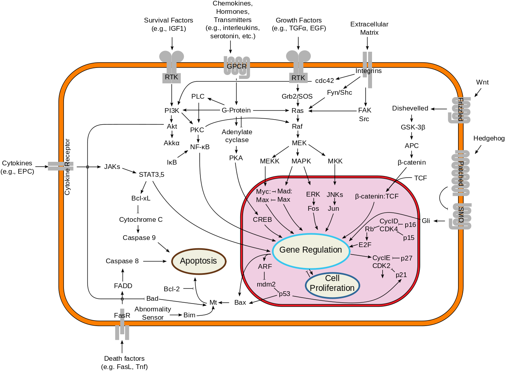

## Lesson preamble

In developing this series of lectures I have referred heavily to the notes from Nonlinear Physics,
[PHY1460](https://www.physics.utoronto.ca/students/graduate-courses/current/phy1460s), 
which I would encourage anyone who is interested in getting more in depth on the quantitative analysis 
of dynamical systems to take or audit. I also refer to "Nonlinear Dynamics and Chaos" by Steven Strogatz, 
a very good textbook which you might find helpful. You can find the pdf online, it's available as an e-book
from the UofT library, and it's available in the Physics library as a hard copy course reserve.

> ### Learning objectives:
>
> - Appreciate the purpose and usefulness of modelling real-world systems
> - Understand the use of differential equations to model populations
> - Qualitatively analyze one-dimensional population models by hand and in R
>     - Find fixed points graphically in R
>     - Analyze stability graphically in R
>     - Draw one-dimensional phase portraits by hand

> ### Lesson outline:
> 
> Total lesson time: 2 hours
> 
> - Introduction to modelling (20 min)
> - Setting up a model (40 min)
> - Qualitative analysis of one-dimensional models (60 min)

----

## Introduction - why model?

<!--*How many have taken some theoretical ecology before?*-->

1. Models can simplify a complex system and help us identify what's important.
  - Biology, as we all know, is extremely complicated.
  - Models summarize what we think we know about a system, 
  force us to identify the important parameters, and encourage us to distill 
  them down to a manageable number of parameters.
   
   *Note*: that's not always how modelling is done. Sometimes you just add everything you can think of 
   to your very complicated model, and you hope by doing that, your model will be more accurate 
   and make better predictions. But your model will likely 
   be too complicated to solve analytically. (Analytical = a version you can leave with variables 
   instead of putting numbers in. In R we will mostly be simulating.) An example of a discipline where 
   the models tend to be complicated is systems biology - models of celluar pathways often try to 
   include as many components as are known, i.e. taking all the components from the following 
   picture and creating a corresponding model:  
   
   
  
2. Models can show us something we didn't expect, that we couldn't intuit from just thinking about the problem. 
  - if your model is simple enough, it can be predictive in a broadly applicable way. We'll talk about some
  famous ecological models, and the assignments will also include more examples. I will also include some
  famous examples from physics, where this field is known as *nonlinear dynamics*. Many of these classic 
  models are classic because their results weren't obvious before the model was created. 
    - example: Lorenz model of the atmosphere which exhibits chaos ([video](https://www.youtube.com/watch?v=FYE4JKAXSfY)). I wrote a quick simulation in R which you can play around with, it's at the bottom of these notes.
    - example: Lotka-volterra predator-prey model. 

*Aside*: I do theoretical biophysics, which is quite similar to theoretical ecology in my case, 
so all of what I'll be telling you about is techniques and concepts that I have found useful 
or use very frequently and that I think are an important part of the theorist / data scientist toolkit. 

3. In the next few lectures we will talk about models and about using R to analyze models. 
We will first do this qualitatively (no math), then quantitatively. We will talk about fitting models to data,
and by the end I hope that you will be able to incorporate modelling into your project, 
whether a model you design yourself or an existing ecological model. 

## Setting up a model

Let's look at some examples of one-dimensional models and talk about what we can learn from these models
qualitatively, without doing any calculations.

**Dimension**: the number of variables in your model. (Not the number of parameters.  
Variables are what track the species you're interested in.)

Let's write down a model for the growth of a species. We want to predict how many organisms are present 
in the population at time $t$, and to do that we need to write down an equation that describes how the
population changes with time. The notation for "change in population per change in time" is

$$\frac{dN}{dt}$$

If you've taken calculus, you will recognize this as the first derivative of $N$ with respect to $t$. 
If your calculus is foggy in your memory, when you see this notation think "change in $N$ per change in $t$.
$dN$ is the notation commonly used to mean "a small amount of $N$," so this expression mathematically describes
by what small amount $N$ will change in a small amount of time $dt$. This is also sometimes written as
$\dot{N}$. I will usually use $dN/dt$ but you may see the dot notation in the literature. 
A single dot is shorthand for "first derivative". 

Biologically, $dN/dt$ is the **growth rate** or **rate of change** of a population with $N$ organisms at time $t$. 

What should the growth rate of our population depend on? Let's brainstorm some things. 
There are no wrong answers here: anything you can think of that makes biological sense is a reasonable thing 
to include in a model, although after brainstorming we will write something very simple as an example.

<!-- Possible answers: 
- birth rate $r$
- death rate $\delta$
- number of organisms $N$
- carrying capacity $K$
- rate of predation
- migration rate
- abundance of food -->

Let's make some sample data to help us come up with a simple model.

For bacteria growing in a flask with plenty of food, we know that they divide in two periodically. 
If we take one unit of time to be the time between divisions, we can assume that the population 
approximately doubles at each time point.

```{r}
library(ggplot2) # so that we can use qplot

times = seq(0, 10, by = 0.2)
population_size <- 2^times
qplot(times,population_size) +
  geom_line(aes(x=times,y=population_size))
```

How do we write this assumption as a general model? Let's calculate the difference in $N$ at each time point
and plot this vs. $N$ at the previous time point. 

```{r}

N_diff <- tail(population_size,-1) - head(population_size,-1) # last N-1 points minus first N-1 points
qplot(head(population_size,-1),N_diff)+
  geom_line(aes(x=head(population_size,-1), y=N_diff))
```

This is a straight line, which tells us that the change in $N$ is proportional to $N$, 
and in fact because of the way we defined time, the change in $N$ is exactly $N$. 

Now we have our model: this model describes **exponential** growth of a population and is commonly used 
for microbes growing with plenty of food. 

$$\frac{dN}{dt}=N$$

This is a **differential equation**: an equation that describes how some function of $N$ is related to
derivatives of $N$. (In this case, and probably in this entire course, we'll just be using the first derivative.)

If we wanted time to be something else, like minutes instead of generations, 
we could add a constant of proportionality that captures how often our bacteria divide:

$$\frac{dN}{dt} = rN$$

This says that the population will increase by $r N dt$ in the small time $dt$, 
or the population increases by $N dt$ in time $dt/r$. 

The process we just used to get this model is probably not what you'd do in practice - 
I just wanted to illustrate the connection between exponential growth and this differential equation.

If $r$ is made larger, does the population grow faster or slower? 

## Analyzing models (qualitatively at first)

When you analyze a model, the exact questions you answer will depend on the model. 
But in general, the following questions are ones you will try to answer for any model.

1. What are the **fixed points** of the model? (For which sizes of the population(s) does the population size remain constant in time?) 
2. Which of the fixed points are **stable**? (If the population is slightly different from the fixed point, will it go towards it or away from it?)
3. How do the above depend on parameters of the model?

---------

We will see how to answer these questions quantitatively soon. But let's start by looking at them
qualitatively. We will draw a **phase portrait** of this system, and the techniques we use will be applicable
to almost any model you might come across. 

Let's start answering these questions qualitatively for the exponential growth model. There's a lot of
information in the differential equation we can qualitatively read off. If we plot $dN/dt$ vs $N$, 
the places where $dN/dt = 0$ are the fixed points of our system. Let's do this for the exponential growth model. 

```{r}
N_seq <- seq(-20,20) # make a sequence of N values to plot dN/dt against
dN_dt = N_seq  # assume r = 1

qplot(N_seq,dN_dt)+
  geom_line(aes(x=N_seq,y=0*N_seq)) # a line at zero for visual aid
```
We can also tell whether the fixed points are stable or unstable by looking at the sign of $dN/dt$ 
on either side of the fixed point. For a one-dimensional system, our phase portrait is a line of $N$. 
We mark the fixed point(s) with circles, and we draw an arrow to the left wherever $dN/dt$ is negative, 
and an arrow to the right wherever $dN/dt$ is positive in the regions between fixed points. 

<!-- diagram of phase portrait --> 

This model is a bit boring - there's only one fixed point, and it's unstable. This makes sense - 
we are talking about exponential growth, after all. There's no upper limit. 

--------

Of course in real life there must be an upper limit to growth, otherwise the surface of the earth would be
covered in bacteria several feet thick in a matter of hours. Let's do a quick calculation for fun - how long
would it take for a single bacterial cell undergoing exponential growth to take over the world?

```{r}
cell_volume = 0.6 #micrometres cubed - E. coli cell volume is ~0.6 to 0.7 micrometres^3
growth_rate = 3 # let's say cells divide three times per hour - every 20 minutes (max growth rate of E. coli in good food conditions)

N_t <- function(N0,r,t) { # r is growth rate - divisions per hour, t is time in hours, N0 is starting population
  return(N0*2^(r*t-1)) # the -1 is because the first doubling is included with the factor of 2
}

radius_earth = 6000 # approximately 6000 km 
SA_earth = 4*pi*radius_earth^2 # surface area of earth in km^2

surface_covered <- function(N0,r,t) { # calculate the volume taken up by bacteria in m on the earth's surface
  bac_volume <- N_t(N0,growth_rate,t)*cell_volume # in micrometres cubed
  height_km = bac_volume*(1e-27)/SA_earth # assume the earth is flat compared to the height of our surface - volume is surface area x height of surface above earth. This is height in km
  #surface_volume = height*SA_earth
  
  height_m = height_km*1000 # 1000 m in km
  
  return(height_m)
}

t<-37
message("The bacteria would be ", round(surface_covered(2,growth_rate,t),1),  " metres thick on the surface of the earth after ", t, " hours.") #yikes. In less than two days, we would be submerged in bacteria. 
```

Let's look at another model, the *logistic growth model*, which most of you will have seen before:

$$\frac{dN}{dt} = rN\left(1-\frac{N}{K}\right)$$

$N$ is the number of organisms, $r$ is the growth rate, and $K$ is the carrying capacity of the system. 

Notice that when $N$ is much smaller than $K$, this reduces to the exponential growth model we just looked at since $N/K \approx 0$. 

Let's again plot $dN/dt$ vs. $N$ to find the fixed points:

```{r}
N_seq <- seq(-20,100) # make a sequence of N values to plot dN/dt against

logistic_eqn <- function(N,r,K) { # calculate dN/dt for the logistic equation
  return(r*N*(1-N/K))
}

dN_dt = logistic_eqn(N_seq,r=0.5,K=80)  # notice the vectorized implementation

qplot(N_seq,dN_dt) +
  geom_line(aes(x=N_seq,y=0*N_seq)) # a line at zero for visual aid
```

The fixed points are at $N=0$ and $N=80$. If we change $K$, we can figure out that the second fixed point is actually just $N=K$. 

Now we draw the phase portrait (on blackboard):

<!-- Phase portrait for logistic eqn -->

As with the exponential growth model, the fixed point at $0$ is unstable, but now there is also a 
fixed point at $K$ which is stable. This means that at long times, the system will go towards $N=K$. 

### Note: the importance of stability

Why is stability important? The real world is noisy, and while mathematically an unstable fixed point is 
still a fixed point (if you were exactly there you would stay there forever), in reality there will 
always be small perturbations (perhaps a member of the population dies or migrates in) that will move 
you away from the fixed point. The important thing to know, then, is whether the population will remain 
close to that fixed point or move away to a different point. 

Think of a ball balanced perfectly on top of a hill, or think of balancing a pen on your finger, 
or think of balancing a chair on the back two legs. It can stay there as long as there are no disturbances, 
but the tiniest breath of wind or tremble in your balance will knock it over and it will go towards its other
fixed point - the ground.

### Note: discrete vs. continuous

There is a subtlety to these differential equation descriptions of models. To see this, calculate
$\frac{dN}{dt}$ for $r=1$ and $N=0.1$. Is this value positive, negative, or zero? Think about what $N=0.1$
means biologically. Does it make sense that the population should increase if $N=0.1$?

```{r}
r <- 1
N <- 0.1

print(r*N)
```

Clearly, if $N$ represents a real population, it can only ever take integer values (it must be *discrete*), 
and it can never be negative. But there's nothing in the model by itself, $\frac{dN}{dt} = rN$, that requires
any of those things. Models like this are *continuous* - the variable $N$ can be any real number and isn't
restricted to integers. 

How do we reconcile this with the real world? For "large" population sizes, the continuous description is
fairly accurate, since if $N$ is, say, 400, then a change of $\pm 1$ is a relatively small change, and we can
think of $N$ as varying continuously. But for small populations, the continuous description breaks down. 
If $N$ falls below $1$, the continuous description might tell you that it can bounce back, but in reality 
$N<1$ means the population is extinct. Even though $N=0$ was an unstable fixed point for the systems we 
looked at so far, it's what is called and **absorbing** state: once you enter it, you can never leave 
(unless we add something back in, of course). 

There is a way to model the discreteness of a population so that small population sizes are treated
realistically, and time permitting I will talk about it a bit - it's called "stochastic simulation" 
and the most common method is to use the Gillespie algorithm.

### Extras: Lorenz simulation in R
```
# Simulation of the Lorenz system, a chaotic model (plotted in 2D)

library(animation)

ani.options(interval=.001)

# dynamical equations for the lorenz system
dotx <- function(x,y,sigma){
    return(sigma*(y-x))
}

doty <- function(x,y,z,rho){
    return(x*(rho-z) - y)
}
    
dotz <- function(x,y,z,beta){
    return(x*y - beta*z)
}

# parameters
sigma <- 10
beta <- 8/3
rho <- 28

dt <- 0.02 #timestep
tmax <- 8
points <- tmax/dt

t_vector = seq(0, tmax, by = dt)

xinit <- 0.5
yinit <- 0.6
zinit <- 0.7

# vectors to store simulation
x_vector<-numeric(points); y_vector<-numeric(points); z_vector<-numeric(points)

# initialize variables
x = xinit
y = yinit
z = zinit

saveGIF({
    count <- 1
    for (t in t_vector){ 
      count <- count + 1
      dx <- dotx(x,y,sigma)*dt
      dy <- doty(x,y,z,rho)*dt
      dz <- dotz(x,y,z,beta)*dt
      
      x <- x + dx
      y <- y + dy 
      z <- z +  dz
    
      x_vector[count] <- x
      y_vector[count] <- y
      z_vector[count] <- z
      plot(x_vector,y_vector, ylim = c(-30,30), xlim = c(-30,30))
    }
})
```
