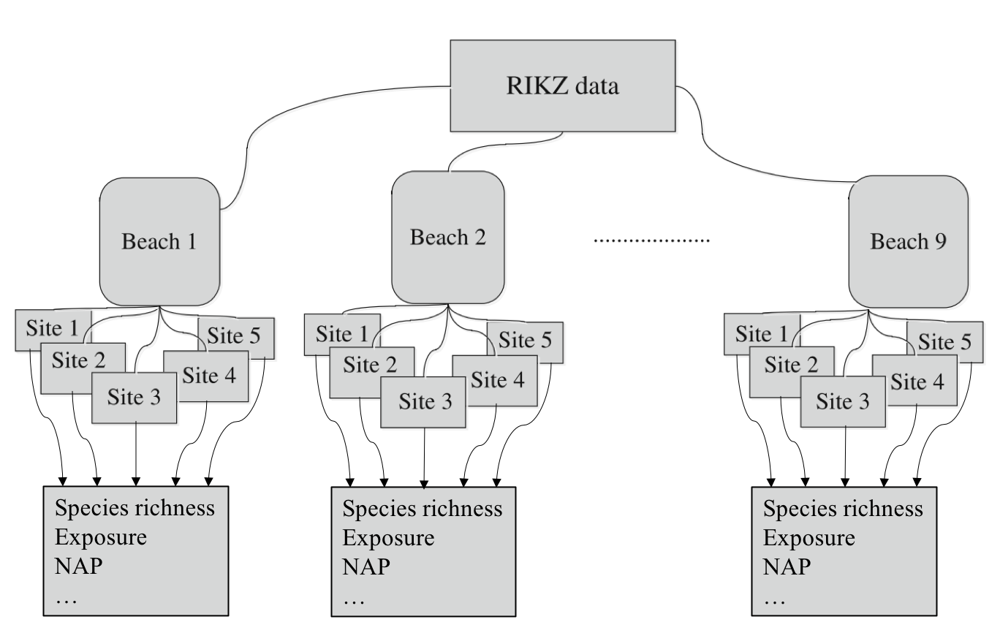
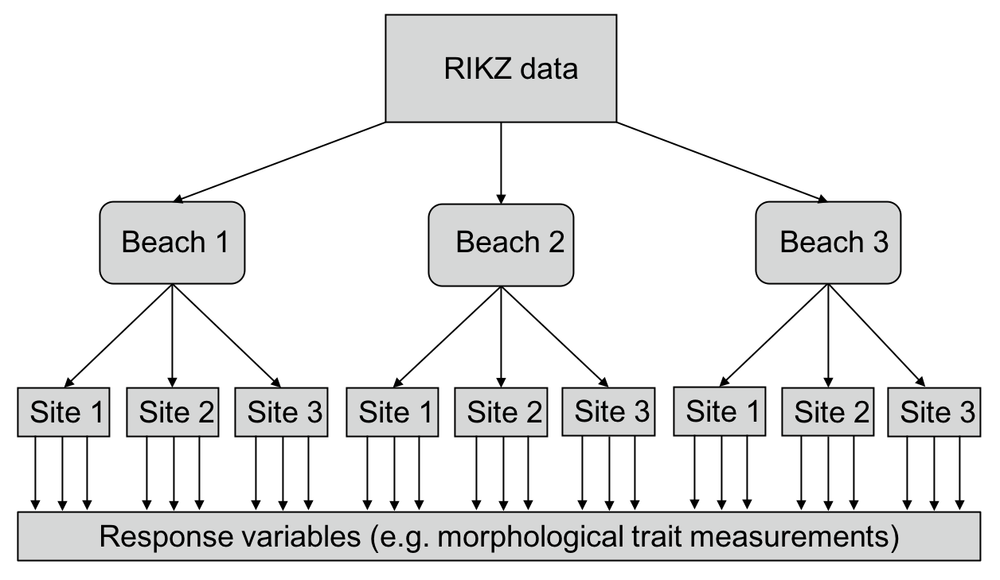
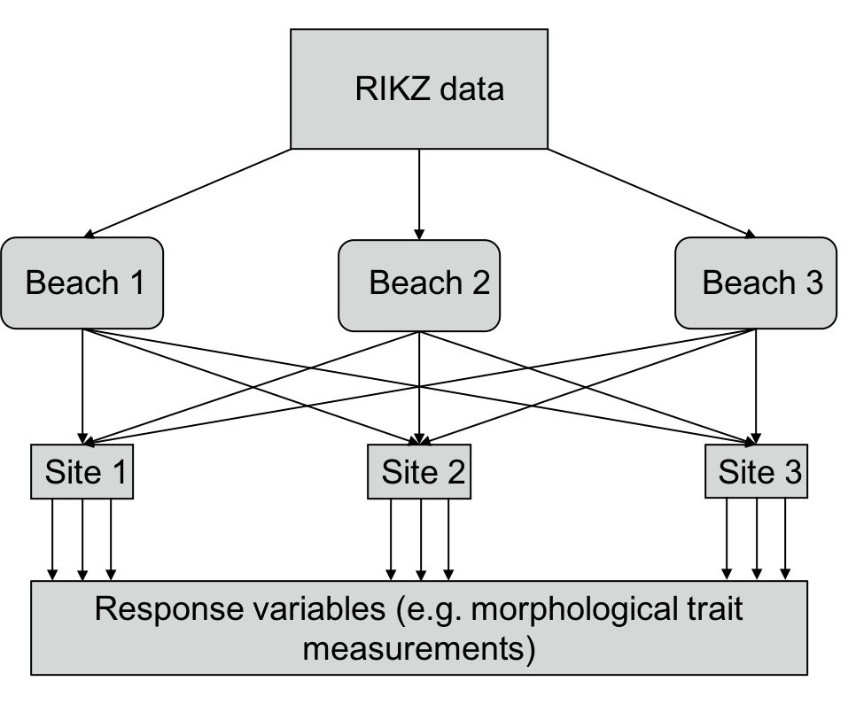

## Lesson preamble

> ### Learning objectives
>
> - Understand the limitation of standard linear models (e.g. linear regression, ANOVA).
> - Understand the benefits of mixed-effects modelling.
> - Understand the difference between fixed and random effects.
> - Apply random intercept and random intercept and slope models to nested experimental data.
> 
> ### Lesson outline
> 
> Total lesson time: 2 hours
>
> - Load and familiarize ourselves with the RIKZ data that will be used for the majority of today's lesson (10 min)
> - Perform standard linear regression on a subset of the RIKZ data and check assumption of model (i.e. recap from last week, 15 min)
> - Explore in greater detail violation of an important assumption of standard linear models; namely, the independence of observations.
>      - Explore ways to overcome this violation without the use of mixed-effects models. What are the drawbacks of these approaches? (15 min)
>      - Apply both random intercept, random intercept and slope models and simple random-effects only models to RIKZ data. What are the differences between these models? Interpret model output. (40 min)
>      - Using mixed-effects models for more deeply nested data. Difference between nested and crossed random effects (20 min)
> - Discussion of fixed vs random effects, ML vs. REML, other types of mixed-effects models (e.g. GAM models, alternative variance structures, etc.) (20 min)
> 
> ### Setup
>
> - `install.packages('plyr')`
> - `install.packages('dplyr')` (or `tidyverse`)
> - `install.packages('ggplot2')` (or `tidyverse`)
> - `install.packages('broom')` (or `tidyverse`)
> - `install.packages('lme4')`
> - `install.packages('lmerTest')`

## Quick linear model recap and extension

Last week we discussed how to apply linear models to data (e.g. linear regression, ANOVA, etc.) to understand the relationship between predictor (i.e. independent)
and response (i.e. dependent) variables. While such models are incredibly powerful, they are underlain by numerous assumptions that should be met prior to placing any confidence in their results. As a reminder, these assumptions are:

1. Normality at each X value (or of the residuals)
2. Homogeneity of variances at each X
3. Fixed X
4. Independence of observations
5. Correct model specification

Typically, small amounts of non-normality and variance heterogeneity is alright and will not strongly bias the results. However, serious heterogeneity and violations of independence can pose serious problems and result in biases parameter estimates and P-values. What's more, ecological and evolutionary data are often very messy, with a lot of noise and unequal sample sizes and missing data, which can help drive these violations. Thankfully, mixed-effects models provide us with many ways to incorporate violations of these assumptions directly into our models, allowing us to use all of our data and have greater confidence in our parameter estimates and inferences.  


## The RIKZ dataset

Throughout the first part of this lecture, we will be making use of the RIKZ dataset, described in Zuur *et al.* (2007) and Zuur *et al.* (2009). For each of 9 intertidal areas (denoted 'Beaches'), the researchers sampled five sites (denoted 'Sites') and at each site they measured abiotic variables and the diversity of macro-fauna (e.g. aquatic invertebrates). Here, species richness refers to the total number of species found at a given site while NAP (i.e. Normal Amsterdams Peil) refers to the height of the sampling location relative to the mean sea level and represents a measure of the amount of food available for birds, etc. For our purpose, the main question is: 

1. **What is the influence of NAP on species richness?** 

A diagrammatic representation of the dataset can be seen below (Modified from Zuur *et al.* (2009), Chapter 5).



Let's start by loading and examining the data. 

```{r Load and examine data}
# Load data
rikz_data <- read.table("./data/rikz_data.txt",
                        head = TRUE,
                        sep = "\t")
rikz_data$Beach <- as.factor(rikz_data$Beach)

# Examine structure of the dataframe and view first 5 columns
str(rikz_data)
head(rikz_data)
```

We can see that the data contains 45 rows (observations). As expected, these observations were taken across 9 beaches, each with 5 sites. We have encoded 'Beach' as a factor, which will facilitate plotting and its use as a random effect downstream. Let's go ahead and perform a linear regression to examine the relationship between species richness and NAP, pooling data across all beaches

## Standard linear regression

```{r Standard linear regression}
# Run basic linear model using all of the data.
basic.lm <- lm(Richness~ NAP, data = rikz_data)
summary(basic.lm)
```

From the model output above, it looks like NAP is significantly, negatively (Estimate < 0) associated with species richness. Let's plot this relationship to see what it looks like.

```{r Plot Richness against NAP, message=FALSE}
# Plot relationship from above model
library(ggplot2)
ggplot(rikz_data, aes(x = NAP, y = Richness)) +
    geom_point() +
    geom_smooth(method = "lm") +
    theme_classic()
```

However, before we trust this result, we should confirm that the assumptions of the linear regression are met. We can plot the residuals against the fitted values (homogeneity and independence) and a QQ-plot (normality). Thankfully, R's base plotting function does all of this work for us. 

```{r Check assumptions}
# Check assumptions.
# Normality homogeneity of variance violated
par(mfrow=c(2,2))
plot(basic.lm)
```

The first and third panels suggest that the homogeneity assumption is violated (increasing variance in the residuals with increasing fitted values). Similarly, panel 2 suggests non-normality (points falling off of the dotted line). A third-root transformation of the response variable (i.e. Richness) seems to alleviate both of these problems. 

- **Tip: **Right skewed response variables can be normalized using root transformations (e.g. square root, log, third-root, etc.), with greater roots required for increasingly right-skewed data. Left skewed response variables can be normalized with power transformations (e.g. squared, 3rd power, etc.)
 
Nonetheless, for the analyses in this section, we will ignore violations of these assumptions for the purpose of better illustrating mixed-effects modelling strategies on untransformed data. In fact, these data violate another, potentially more problematic assumption, namely, the observations are not independent. 

## Non-independence of observations

Remember, the species richness data come from multiple sites within multiple beaches. While each beach may be independent, sites within a beach are likely to have similar species richness due simply to their proximity within the same beach. In other words, observations among sites within a beach are **not independent**. Another way of saying this is that the data are **nested**. Nesting in this sense is a product of the experimental design (i.e. we chose to sample 5 sites within each beach) and not necessarily of the data itself. Other types of nested data include: sampling the same individual pre- and post-treatment or sampling them multiple times (i.e. repeated measures) or sampling multiple tissues from the same individuals. We can visualize the non-independence of observation within the same beach by producing a figure similar to the one above but clustered by beach (each beach is a different colour).

```{r Richness against NAP, message=FALSE}

library(plyr)

# Function to find polygons
find_hull <- function(df) df[chull(df$Richness, df$NAP), ] 

# Identify polygons in data
hulls <- ddply(rikz_data, "Beach", find_hull) 

# Plot
ggplot(rikz_data, aes(x = NAP, y = Richness, colour = Beach)) +
    geom_point(size = 3) +
    theme_classic() +
    theme(legend.position = "none") +
    scale_colour_brewer(palette="Set1") +
    scale_fill_brewer(palette="Set1") +
    geom_polygon(data=hulls, aes(fill = Beach), alpha = 0.2)
```

As you can see, observations from the same beach tend to cluster together. If the observations were independent, all of the clusters would overlap. Instead, observations from one beach are one average more similar to those within the same beach than to those from other beaches. We need to account for this non-independence in our modelling. 

## Accounting for non-independence

One approach to account for this non-independence would be to run a separate analysis for each beach, as shown in the figure and table below. 

```{r Plot beaches separately}
# We could account for non-independence by running a separate analysis 
# for each beach
ggplot(rikz_data, aes(x = NAP, y = Richness)) +
    geom_point() +
    geom_smooth(method = "lm") +
    facet_wrap(~ Beach) +
    xlab("NAP") + ylab("Richness") +
    theme_classic()
```
```{r Analysis separate beaches, message=FALSE}
# Run linear model of Richness against NAP for each beach
library(dplyr)
beach_models <-  rikz_data %>%
    group_by(Beach) %>%
    do(mod = lm(Richness ~ NAP, data = .))

# Get the coefficients by group in a tidy data_frame
library(broom)
dfBeachModels = tidy(beach_models, mod)
dfBeachModels %>% filter(term == "NAP") %>% select(estimate, p.value)
```

However, the issue with this approach is that each analysis only has 5 points (a really low sample size!) and we have to run multiple tests. As such, we run the risk of obtaining spuriously significant results purely by chance. This is not the best approach. Perhaps instead we can simply include a term for beach in our model, thereby estimating its effects. This is done in the model below. 

```{r Beach as fixed effect}
basic.lm <- lm(Richness ~ NAP + Beach, data = rikz_data)
summary(basic.lm)
```

That's a lot of terms! Note what's happening here. The model is estimating a separate effect for each level of beach (8 total since 1 is used as the reference). Because we need one degree of freedom to estimate each of these, that's a total of 8 degrees of freedom! In this case, it had little effect of changing our interpretation of the effects of NAP on richness (which is still negative and significant). However, sometimes the inclusion of additional terms in this way will change the estimated effect of other terms in the model and alter their interpretation. The question we need to ask ourselves here is: *Do we really care about differences between beaches?* Maybe but probably not. These beaches were a random subset of all beaches that could have been chosen but we still need to account for the non-independence of observations within beaches. This is where random-effects become useful. 

## Random-effect models

### Random intercept model

We do not want to pay the steep price of 8 degrees of freedom to include a Beach term in our model but still want to estimate the variance among beaches and must account for the non-independence of sites within beaches. We can do this by including it as a **random effect**, while NAP remains a **fixed effect**. As such, we model a separate y-intercept (i.e. Richness at NAP = 0) for each beach and estimate the variance around this intercept. A small variance means that variances per beach are small whereas a large variance means the opposite (this will become clearer shortly). We can run mixed-effects models using the `lmer` function from the `lme4` R package and obtain parameter estimates using the `lmerTest` package. The question we are now asking is: 

1. **What is the influence of NAP on species richness, after accounting for variation within beaches?**

```{r Random intercept model, message=FALSE}
library(lme4)
library(lmerTest)

# Random intercept model with NAP as fixed effect and Beach 
# as random effect
mixed_model_IntOnly <- lmer(Richness ~ NAP + (1|Beach), 
                            data = rikz_data, REML = FALSE)
summary(mixed_model_IntOnly)
```

The `(1|Beach)` is the random effect term, where the `1` denotes this is a random-intercept model and the term on the right of the `|` is a nominal variable (or factor) to be used as the random effect. Note that it's considered best practice that random effects have at least 5 levels, otherwise it should be used as a fixed effect (we have 9 so we're good!). From top to bottom, the output is telling us that the model was fit using maximum likelihood with parameters estimated using the Satterthwaite approximation. It then gives  us the AIC, BIC and log-likelihood values for this particular model. I'm sure most of this sounds like jargon. Don't worry! These will become clearer later and AIC will be especially useful for our lecture on Model Selection (Lecture 11). The next part is important: It gives us the estimated variance for the random effects in the model. Here, it's telling us that the variance associated with the effect of beach is `7.507`. In other words, difference between beaches account for  `(7.507 / 9.111) * 100 = 82%` of the residual variance after accounting for the fixed effects in the model. Finally, we have the fixed effect portions of the model, with a separate intercept, slope and P-value for the effect of NAP. Let's visualize the fitted values for this model. 

```{r Random intercept fitted values}
# Let's predict values based on our model and add these to our dataframe
# These are the fitted values for each beach, which are modelled separately.
rikz_data$fit_InterceptOnly <- predict(mixed_model_IntOnly)

# Let's plot the 
ggplot(rikz_data, aes(x = NAP, y = Richness, colour = Beach)) +
    # Add fixed effect regression line (i.e. NAP)
    geom_abline(aes(intercept = `(Intercept)`, slope = NAP),
                size = 2,
                as.data.frame(t(fixef(mixed_model_IntOnly)))) +
    # Add fitted values (i.e. regression) for each beach
    geom_line(aes(y = fit_InterceptOnly), size = 1) +
    geom_point(size = 3) +
    theme_classic() +
    theme(legend.position = "none") +
    scale_colour_brewer(palette="Set1")
```

The thick black line corresponds to the fitted values associated with the fixed-effect component of the model (i.e. `6.58 x -2.58(x)`). The thin coloured lines correspond to the fitted values estimated for each beach. As you can see, they all have separate intercepts, as expected. As the estimated variance of the random effect increases, these lines would become more spread around the thick black line. If the variance was 0, all the coloured lines would coincide with the thick black line. 

### Random intercept-slope model

The model above allows the intercept for each beach to vary around the population-level intercept. However, what if beach don't only vary in their mean richness, but the richness on each beach also varies in its response to NAP. In standard regression terms, this would amount to including NAP, Beach and NAP x Beach effects in the model. Of course, including such fixed-effects here would consume way too many degrees of freedom and we already decided we don't really care about differences between beaches. Thankfully, we can still allow beaches to vary in the response to NAP using a **random intercept-slope model**. We can fit the random intercept-slope model to these data using the code below.

```{r Random intercept-slope model}
# Random intercept and slope model
mixed_model_IntSlope <- lmer(Richness ~ NAP + (1 + NAP|Beach), 
                             data = rikz_data, REML = FALSE)
summary(mixed_model_IntSlope)
```

The above model now allows both the intercept and slope of the relationship between Richness and NAP to vary across beaches. The only difference here is the additional variance component in the random effects, which estimates the variance in slopes across beaches. It also includes a `Cor` term, which estimates the correlation between the intercept and slope variances. At -1, this implies that beaches with larger intercepts also have more steeply negative slopes, as can be seen in the figure below. 

```{r Random intercept-slope fitted values}
rikz_data$fit_IntSlope <- predict(mixed_model_IntSlope)
ggplot(rikz_data, aes(x = NAP, y = Richness, colour = Beach)) +
    geom_abline(aes(intercept = `(Intercept)`, slope = NAP),
                size = 2,
                as.data.frame(t(fixef(mixed_model_IntSlope)))) +
    geom_line(aes(y = fit_IntSlope), size = 1) +
    geom_point(size = 3) +
    theme_classic() +
    theme(legend.position = "none") +
    scale_colour_brewer(palette="Set1")
```

### Random effects only model

Note that it is not always necessary to specify fixed effects, in the same way that it is not always necessary to specify random effects. For example, we could run the following model.

```{r Random effects only model}
mixed_model_NoFix <- lmer(Richness ~ 1 + (1|Beach), 
                          data = rikz_data, REML = TRUE)
summary(mixed_model_NoFix)
```

Now that we have specified these three different models, how do we know which to choose? After all, they all provide slightly different estimates for the effects of NAP (if NAP is even included) and P-values. We will come back to this question in Lecture 11 when discussing model selection. 

## Deeply nested and crossed effects

Have a look back at the original diagram showing the layout of the RIKZ data and the dataset itself. Ever site within each beach is associated with only one observation for each of the variables (e.g. Species richness). As such, we used mixed-effects modelling to account for the variance among these 5 observations within each of the five beaches. But what about if each of those sites additionally included multiple samples (e.g. measurements of morphological traits of multiple individuals of a species), as in the diagram below?. We would the need to account for the variance both within sites and within beaches.



Thankfully, `lmer` allows us to do this quite easily. To account for variation within sites **and** within beaches, we would need to modify our existing random effect term. We would write this as `(1|Beach/Site)`, which means "Site nested within beach". This expands to — and can also be written as — `(1|Beach) + (1|Beach:Site)`. Thus, we are modelling a separate intercept for every beach and for every site within beach. I should pause for a moment here and say that the 'Site 1' from 'Beach 1' is **not** the same as 'Site 1' from 'Beach 2' and this was true of the original data as well. These sites are distinct; despite carrying the same label, they are occurring on distinct beaches and are thus not the same site. This is what makes the data nested.
 
An alternative design to this would be **crossed effects**, in which any site could be observed on any beach. If all sites were observed on all beaches, this would be a **fully crossed effect** whereas if some sites were observed on only some beaches, this would be a **partially crossed effect**. Crossed effects are shown in the diagram below. This may sound confusing. The easiest way to think about it is that if the data are not nested, they are crossed. 



I will illustrate both deeply nested and crossed random effects in a single model using data from Fitzpatrick *et al.* (In review). The authors were interested in understanding whether soil microbes can help plants cope with stress imposed by drought and how this can influence plant evolution. To do this, Fitzpatrick *et al.* grew 5 plants from each of 44 *Arabidopsis thaliana* accessions in each combination of the following treatments: 

1. Well-watered and live soil (i.e. with microbes)
2. Well watered and sterile soil
3. Drought and live soil
4. Drought and sterile soil

The experiment took place inside of growth chambers at the University of Toronto, where plants were randomly assigned into trays, which were then randomly assigned onto racks in the growth chamber. Thus, plants only occurs within one tray and each tray only occurs within one rack (tray is nested within rack). Given that plants within a tray could be more similar to one another than plants from another tray (i.e. tray effect) and the same is true for racks, this non-independence needs to be accounted for. However, every accession occurred on every rack (i.e. crossed effect) and individual plants from an accession are likely to be more similar to other plants from that accession than to plants from another accession. Again, this non-independence needs to be accounted for. The authors tracked flowering date and counted the number of fruit produced by each plant (n = 879) at the end of the experiment. The code below provides a useful way of examining the data to assess whether terms are nested or crossed and then fits a mixed-effects model to the Fitzpatrick *et al.* data. The question we are interested in here is: **Do soil microbes, drought, or their interaction influence the number of fruit produced by _A. thaliana_ plants?**

```{r Fitzpatrick 2018 data}
# Load in and examine data
Fitz_data <- read.csv("data/Fitzpatrick_2018.csv", header = TRUE)

# Let's change some columns to factors and remove rows with no fruit data
Fitz_data <- Fitz_data %>%
                 mutate(tray = as.factor(tray),
                        rack = as.factor(rack),
                        accession = as.factor(accession)) %>%
                 filter(!is.na(fruit))


str(Fitz_data)
head(Fitz_data)

#Let's look at how trays breakdown across the levels of rack
xtabs(~ rack + tray, Fitz_data)
```

As you can see above, each tray occurs in only one rack. This is an indication that the data are nested (i.e. tray is nested within racks). Let's now look at how accessions breakdown across the racks

```{r Fitzpatrick 2018 cont.}
# Breakdown of accessions across the racks
xtabs(~ rack + accession, Fitz_data)
```

In this case, we see that every accession occurs on every rack. In other words, accession and rack are fully crossed. Let's go ahead and fit our model.

```{r Fitzpatrick 2018 model}
# Fit mixed-effects model
Fitz_mod <- lmer(fruit ~ water + microbe + water:microbe + 
                     (1|rack/tray) + (1|rack:accession), 
                 data = Fitz_data)
summary(Fitz_mod)
```

Notice we are now estimating 3 random-effect variance components. First, we are estimating the variance among accessions, which explains the most residual variance among the random effects (`(72.510 / 116.808) * 100 = 62%`). We then estimate the variance between trays, followed by the variance between racks (which has only a minor effect). From the fixed effects, we see that the watering treatment had a significant effect on the number of fruit produced (main effect of `water`), although its effect depended on the presence of microbes (`water:microbe` interaction). While we will not go into the details of these results here, this example serves to illustrate how nested and crossed random effects are encoded in linear-mixed effects models. 

## Additional considerations

**Fixed vs. random effects**

* Fixed effects are the things you care about and want to estimate. You likely chose the factor levels for a specific reason or measured the variable because you are interested in the relationship it has to your response variable. 
* Random effects can  be variables that were opportunistically measured whose variation needs to be accounted for but that you are not necessarily interested in (e.g. spatial block in a large experiment). The levels of the random effect are likely a random subset of all possible levels (although there should be at least 5). However, if the experimental design includes nesting or non-independence of any kind, this needs to be accounted for to avoid pseudoreplication.
    
**REML or ML**

The math behind maximum likelihood (ML) and restricted maximum likelihood (REML) is beyond this course. Suffice it to say that if your interested in accurately estimating the random effects, you should fit the model with REML whereas if you're interested in estimating the fixed effects, you should fit the model with ML. Given that we are often most interested in the fixed effects, ML is usually the most appropriate (but see Lecture 11: model selection). The difference in the estimates obtained by ML and REML increases as the number of parameters in the model increases. 

**Other models**

Mixed-effects models are very powerfully when correctly applied. For example, they allow modelling of non-linear relationships (e.g. GAM models), modelling separate variances across factor levels to account for heterogeneity of variance, fitting alternative error structures to account for temporal and spatial non-independence, etc. This lecture covered the type of mixed-effects model that is most often encountered by ecologists and evolutionary biologists (at least in my experience). Nonetheless, if you find yourself needing something more, I'll refer you to the reading list below. 

## Additional reading

1. Zuur, A. *et al.* 2009. Mixed effects models and extensions in ecology with R. *Springer*
2. Bates, D. *et al.* 2015. Fitting linear mixed-effects models using lme4. *Journal of Statistical Software* 67: 1-48.
3. [Crossed vs. Nested random effects](https://stats.stackexchange.com/questions/228800/crossed-vs-nested-random-effects-how-do-they-differ-and-how-are-they-specified)
4. [Fixed vs. Random effects](https://stats.stackexchange.com/questions/4700/what-is-the-difference-between-fixed-effect-random-effect-and-mixed-effect-mode)
5. [ML vs. REML](https://stats.stackexchange.com/questions/41123/reml-vs-ml-stepaic)
