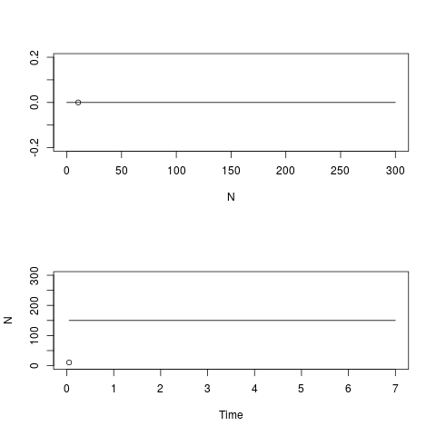

## Lesson preamble

In developing these lectures I have referred heavily to the notes from Nonlinear Physics,
[PHY1460](https://www.physics.utoronto.ca/students/graduate-courses/current/phy1460s), 
which I would encourage anyone who is interested in getting more in depth on the quantitative analysis 
of dynamical systems to take or audit. I also refer to "Nonlinear Dynamics and Chaos" by Steven Strogatz, 
a very good textbook which you might find helpful. You can find the pdf online, it's available as an e-book
from the UofT library, and it's available in the Physics library as a hard copy course reserve.

> ### Learning objectives
>
> - Appreciate the purpose and usefulness of population models in ecology
> - Understand the use of differential equations to model populations
> - Qualitatively analyze one-dimensional population models by hand and in R
>     - Find fixed points graphically in R
>     - Analyze stability graphically in R
> - Numerically solve differential equations in R using R's ODE solver
>
> ### Lesson outline
> 
> Total lesson time: 2 hours
> 
> - Introduction to modelling (10 min)
> - Setting up a model (20 min)
> - Analysis of one-dimensional models (40 min)
> - Numerically solving differential equations (30 min)
> 
> ### Setup
> 
> - `install.packages('tidyverse')` (done already)
> - `install.packages('deSolve')`

<!-- - Optional: install `animation`: run `install.packages('animation'). This is only if you want to play around with the simulations at the bottom later. -->

```{r math_shortcut, echo=FALSE}
eq_dn_dt <- "$\\frac{dN}{dt}$"
```

-----

## Introduction - why model populations?

Until now in this class, we've been talking about (mostly) linear models that are used to 
determine how different variables relate to each other in a dataset (AKA "stats"). This week, I'll be talking
about models that are used to summarize a biological idea about how populations behave in time. 
The specific models I'll be talking about will likely be familiar to you from your previous ecology classes.

<!--*How many have taken some theoretical ecology before?*-->

1. Models can simplify a complex system and help us identify what's important.
    - Biology is extremely complicated.
    - Models summarize what we think we know about a system, 
    force us to identify the important parameters, and encourage us to distill 
    them down to a manageable number of parameters.
    - Data don't always fit theoretical models, but it is helpful to interpret data with a larger theoretical framework in mind.

2. Models can show us something we didn't expect, that we couldn't intuit from just thinking about the problem. 
    - if your model is simple enough, it can be predictive in a broadly applicable way. We'll talk about some
    famous ecological models, and the assignment will include more examples. I will also include some
    famous examples from physics, where this field is known as **nonlinear dynamics**. Many of these classic 
    models are classic because their results weren't obvious before the model was created. 
        - example: Lorenz model of the atmosphere which exhibits **chaos** ([video](https://www.youtube.com/watch?v=FYE4JKAXSfY)). 
        The equations for this system are simple, but Lorenz was surprised to find that the 
        behaviour of the system could be very different for starting conditions that were very similar. 
        I wrote a quick simulation in R which you can play around with, it's at the bottom of these notes.
        - example: Lotka-volterra predator-prey model. 
        This model predicts never-ending oscillations in the populations of predator and prey species.
        A simulation for this is also at the bottom of these notes.
            - What else is a reasonable thing that could happen to a population of predator and prey? 
            
          <!--Possible answers: 
          - predators eat all the prey and the prey dies, then the predator dies. 
          - predators and prey reach an unchanging steady-state -->

        *Aside*: I do theoretical biophysics, which is quite similar to theoretical ecology in my case, 
        so all of what I'll be telling you about is techniques and concepts that I have found useful 
        or use very frequently and that I think are an important part of the theorist / data scientist toolkit. 

3. In the next two lectures we will talk about population models and about using R to analyze models. 
We will talk about fitting models to data,
and by the end I hope that you will be able to incorporate modelling into your project, 
whether a model you design yourself or an existing ecological model. 

## Setting up a population model

Let's look at some examples of one-dimensional population models and talk about what we can 
learn from these models qualitatively, without doing any calculations.

**Dimension**: the number of variables in your model. (Not the number of parameters. 
Variables are what track the species you're interested in, 
and parameters are numbers that specify the details of the model.)

Let's write down a model for the growth of a species. We want to predict how many organisms are present 
in the population at time $t$, and to do that we need to write down an equation that describes how the
population changes with time. We will start by writing a *recursion relation*, which tells us how 
to update the population size at time $t+ \Delta t$ from the population size at time $t$:

$$N_{t+\Delta t} = N_t + \Delta N$$

$\Delta N$, the change in the population size, will depend on the specifics of our model. Let's rearrange this
expression into the definition of a derivative by moving $N_t$ over and dividing both sides by $\Delta t$,
then taking the limit of $\Delta t$ going to $0$:

$$\frac{N_{t+\Delta t} - N_t}{\Delta t} = \frac{\Delta N}{\Delta t}$$
$$lim_{\Delta t \to 0}\frac{N_{t+\Delta t} - N_t}{\Delta t} = lim_{\Delta t \to 0}\frac{\Delta N}{\Delta t} = \frac{dN}{dt}$$ 

If you've taken calculus, you will recognize this as the first derivative of $N$ with respect to $t$. 
If your calculus is foggy in your memory, when you see this notation think "change in $N$ per change in $t$. For a linear function, this is the same as the $\beta$ coefficient we talked about a few classes ago.

$dN$ is the notation commonly used to mean "a small amount of $N$," so this expression mathematically describes
by what small amount $N$ will change in a small amount of time $dt$. This is also sometimes written as
$\dot{N}$. I will usually use $dN/dt$ but you may see the dot notation in the literature. 
A single dot is shorthand for "first derivative". 

Biologically, $dN/dt$ is the **growth rate** or **rate of change** of a population of $N$ organisms at time $t$. 

What should the growth rate of our population depend on? Let's brainstorm some things. 
There are no wrong answers here: anything you can think of that makes biological sense is a reasonable thing 
to include in a model, although after brainstorming we will write something very simple as an example.

<!-- Possible answers: 
- birth rate $r$
- death rate $\delta$
- number of organisms $N$
- carrying capacity $K$
- rate of predation
- migration rate
- abundance of food -->

Let's make some sample data to help us come up with a simple model.

For bacteria growing in a flask with plenty of food, we know that they divide in two periodically. 
If we take one unit of time to be the time between divisions, we can assume that the population 
approximately doubles at each time point.

```{r}
library(tidyverse) # ggplot2 includes the qplot function
# qplot produces plots that are similar to ggplot, but you don't need a dataframe to use it.
# We could use ggplot instead by first making a dataframe out of our data:
# data <- data.frame(times, population_size)

times <- seq(0, 10, by = 0.2) # make a sequence of time points
population_size <- 2 ^ times # make a sequence for the population size: it doubles at every time point
qplot(times, population_size) +
  geom_line()
```

How do we write our population growth assumption as a general model? Let's calculate the difference in $N$ at each time point
and plot this vs. $N$ at the previous time point. 

```{r}
# last N-1 points minus first N-1 points
N_diff <- tail(population_size, -1) - head(population_size, -1) 

qplot(head(population_size, -1), N_diff) +
  geom_line()
```

This is a straight line, which tells us that the change in $N$ is proportional to $N$, 
and in fact because of the way we defined time, the change in $N$ is exactly $N$. 

Now we have our model: this model describes **exponential** growth of a population and is commonly used 
for microbes growing with plenty of food. 

$$\frac{dN}{dt}=N$$

This is a **differential equation**: an equation that describes how some function of $N$ is related to
derivatives of $N$. (In this case we'll just be using the first derivative.)

If we wanted time to be something else, like minutes instead of generations, 
we could add a constant of proportionality that captures how often our bacteria divide:

$$\frac{dN}{dt} = rN$$

This says that the population will increase by $r N$ per unit of time, 
or the population increases by $N$ in time $1/r$. 

The process we just used to get this model is probably not what you'd do in practice - 
I just wanted to illustrate the connection between exponential growth and this differential equation.

> #### Challenge
>
> If $r$ is made larger, does the population grow faster or slower? 

## Analyzing models

When you analyze a model, the exact questions you answer will depend on the model. 
But in general, the following questions are ones you will try to answer for any population model.

1. What are the **fixed points** of the model? (For which sizes of the population(s) does the population size remain constant in time?) 
2. Which of the fixed points are **stable**? (If the population is slightly different from the fixed point, will it go towards it or away from it?)
3. How do the above depend on parameters of the model?
4. Which parameters fit my data best, and how good is the fit?

We will answer the first two questions qualitatively by graphing our models. 
We will draw a **phase portrait** of this system, and the techniques we use will be applicable
to almost any population model you might come across. 

### The exponential growth model

There's a lot of information in the differential equation we can qualitatively read off. If we plot $dN/dt$ vs $N$, 
the places where $dN/dt = 0$ are the fixed points of our system. Let's do this for the exponential growth model. 

```{r}
N_seq <-
seq(-20, 20) # make a sequence of N values to plot dN/dt against
dN_dt <- N_seq  # assume r = 1

qplot(N_seq, dN_dt) +
  geom_line(aes(x = N_seq, y = 0)) # a line at zero for visual aid
```

$dN/dt = 0$ when $N=0$, so $N=0$ is the only fixed point for this system. 
We can also tell whether the fixed points are stable or unstable by looking at the sign of $dN/dt$ 
on either side of the fixed point. For a one-dimensional system, our phase portrait is a line of $N$. 
We mark the fixed point(s) with circles, and we draw an arrow to the left wherever $dN/dt$ is negative, 
and an arrow to the right wherever $dN/dt$ is positive in the regions between fixed points. 

<!-- diagram of phase portrait --> 

```{r, echo=FALSE}
line <- seq(-2,2)

N <- c(0)
y <- c(0)
ggplot() +
  geom_point(aes(N, y ), pch = 1, size = 3) +
  geom_line(aes(x = line, y = 0)) +
  geom_segment(mapping = aes(x=0.5,y=0, xend = 1, yend = 0), arrow=arrow(), size=2) +
  geom_segment(mapping = aes(x=-0.5,y=0, xend = -1, yend = 0), arrow=arrow(), size=2) +
  theme_classic() +
  theme(axis.title.y=element_blank(),
        axis.text.y=element_blank(),
        axis.ticks.y=element_blank()) 
```

This model is a bit boring - there's only one fixed point, and it's unstable. This makes sense - 
we are talking about exponential growth, after all. There's no upper limit. 

#### Challenge

Find the fixed point(s) of the following differential equation.

$$\frac{dN}{dt} = N - a$$

   - Choose a value for the parameter $a$. Can you think of anything that $a$ might represent in a real population?
   Are there any values of $a$ that don't make biological sense?
   - Plot $\frac{dN}{dt}$ vs. $N$, like we did earlier.
   - Sketch a phase portrait. Are the fixed point(s) stable or unstable?

### The logistic model

Of course in real life there must be an upper limit to growth, otherwise the surface of the earth would be
covered in bacteria several feet thick in a matter of hours. 
Let's look at another model, the *logistic growth model*, which most of you will have seen before:

$$\frac{dN}{dt} = rN\left(1-\frac{N}{K}\right)$$

$N$ is the number of organisms, $r$ is the growth rate, and $K$ is the carrying capacity of the system. 

Notice that when $N$ is much smaller than $K$, this reduces to the exponential growth model we just looked at since $N/K \approx 0$. 

Let's again plot $dN/dt$ vs. $N$ to find the fixed points:

```{r}
N_seq <-
  seq(-20, 100) # make a sequence of N values to plot dN/dt against
  
logistic_eqn <-  function(N, r, K) {
  # calculate dN/dt for the logistic equation
  return(r * N * (1 - N / K))
  }
  
dN_dt <- logistic_eqn(N_seq, r = 0.5, K = 80)  # notice the vectorized implementation
  
qplot(N_seq, dN_dt) +
  geom_line(aes(x = N_seq, y = 0)) # a line at zero for visual aid
```

The fixed points are at $N=0$ and $N=80$. If we change $K$, we can figure out that the second fixed point is actually just $N=K$. 

Now we draw the phase portrait:

```{r, echo=FALSE}
line <- seq(-25,100)

N <- c(0,80)
y <- c(0,0)
ggplot() +
  geom_point(aes(N, y ), pch = 1, size = 3) +
  geom_line(aes(x = line, y = 0)) +
  geom_segment(mapping = aes(x=30,y=0, xend = 50, yend = 0), arrow=arrow(), size=2) +
  geom_segment(mapping = aes(x=-8,y=0, xend = -18, yend = 0), arrow=arrow(), size=2) +
  geom_segment(mapping = aes(x=95,y=0, xend = 85, yend = 0), arrow=arrow(), size=2) +
  theme_classic() +
  theme(axis.title.y=element_blank(),
        axis.text.y=element_blank(),
        axis.ticks.y=element_blank()) 
```

<!-- Phase portrait for logistic eqn -->

As with the exponential growth model, the fixed point at $0$ is unstable, but now there is also a 
fixed point at $K$ which is stable. This means that at longer times, the system will go towards $N=K$. 

### Note: the importance of stability

Why is stability important? The real world is noisy, and while mathematically an unstable fixed point is 
still a fixed point (if you were exactly there you would stay there forever), in reality there will 
always be small perturbations (perhaps a member of the population dies or migrates in) that will move 
you away from the fixed point. The important thing to know, then, is whether the population will remain 
close to that fixed point or move away to a different point. 

Think of a ball balanced perfectly on top of a hill, or think of balancing a pen on your finger, 
or think of balancing a chair on the back two legs. It can stay there as long as there are no disturbances, 
but the tiniest breath of wind or tremble in your balance will knock it over and it will go towards its other
fixed point - the ground.

### Note: discrete vs. continuous

#### Challenge

There is a subtlety to these differential equation descriptions of models. To see this, calculate
$\frac{dN}{dt}$ for the exponential model with $r=1$ and $N=0.1$. Is this value positive, 
negative, or zero? Think about what $N=0.1$
means biologically. Does it make sense that the population should increase if $N=0.1$?

```{r}
r <- 1
N <- 0.1

print(r*N)
```

Clearly, if $N$ represents a real population, it can only ever take integer values (it must be *discrete*), 
and it can never be negative. But there's nothing in the model by itself, $\frac{dN}{dt} = rN$, that requires
any of those things. Models like this are *continuous* - the variable $N$ can be any real number and isn't
restricted to integers. 

How do we reconcile this with the real world? For "large" population sizes, the continuous description is
fairly accurate, since if $N$ is, say, 400, then a change of $\pm 1$ is a relatively small change, and we can
think of $N$ as varying continuously. But for small populations, the continuous description breaks down. 
If $N$ falls below $1$, the continuous description might tell you that it can bounce back, but in reality 
$N<1$ means the population is extinct. Even though $N=0$ was an unstable fixed point for the systems we 
looked at so far, it's what is called an **absorbing** state: once you enter it, you can never leave 
(unless we add something back in, of course). 

There is a way to model the discreteness of a population so that small population sizes are treated
realistically - it's called "stochastic simulation" and the most common method is to use the Gillespie algorithm.

## Recap and some tips

- You can include math in R notebooks using [LaTeX syntax](https://en.wikibooks.org/wiki/LaTeX/Mathematics). 

    `$$\frac{dN}{dt} = r N (1 - N/K)$$` produces 
    $$\frac{dN}{dt} = r N (1 - N/K)$$
    
- **Differential equation**: an equation that describes how a function of
variables is related to derivatives of those variables.

- Drawing **phase portraits** in one dimension:

    

    - Fixed points: values of $N$ at which `r eq_dn_dt`, the rate of change of $N$,
    is $0$. To find fixed points, plot `r eq_dn_dt` vs. $N$ and find the place(s)
    where it crosses the $x$ axis.
    - Stability: if you start at some $N$ close to the fixed point but not exactly
    on it, will you go towards (stable) or away (unstable) from the fixed point? The
    sign of `r eq_dn_dt` on either side of a fixed point tells you whether $N$ will
    increase or decrease in that area. Draw an arrow to the right if `r eq_dn_dt` is
    positive, and draw an arrow to the left if `r eq_dn_dt` is negative.

#### Challenge

Find the fixed point(s) of the following differential equation.

$$\frac{dN}{dt} = \text{sin}(N)$$

   - Plot $\frac{dN}{dt}$ vs. $N$ for $N$ ranging from $0$ to $10$.
   - Sketch a phase portrait on paper. Are the fixed point(s) stable or unstable?

```{r, echo=FALSE, eval=FALSE}
# Challenge solution

library(ggplot2)

N_seq <- seq(0, 10, by = 0.1)

dN_dt <- sin(N_seq)

qplot(N_seq, dN_dt) +
  geom_hline(aes(yintercept = 0))
```

You can think of $dN/dt$ as a *velocity*: it tells you how fast $N$ is changing and in what
direction. If we start a **trajectory** at some initial $N_0$, $dN/dt$ dictates whether $N$ will
increase, decrease, or stay the same. If $N_0$ happens to be at a fixed point, $N$ will remain at
$N_0$ for all time. 

## Numerically simulating models in R

Some differential equations are possible to solve analytically (by integration). 
But when we encounter equations that are hard to solve analytically, we can instead 
solve them **numerically**. Numerically solving a differential equation means calculating
an approximate solution for the variable of interest as it evolves in time, using the information
contained in the equation about the *rate of change* of the variable at each time point. 

Let's use the logistic equation as an example again, plotting $dN/dt$ vs. $N$.

```{r}
N_seq <-
  seq(-20, 100) # make a sequence of N values to plot dN/dt against
  
dN_dt <- logistic_eqn(N_seq, r = 0.5, K = 80)  # use the logistic equation function we defined before
  
qplot(N_seq, dN_dt) +
  geom_line(aes(x = N_seq, y = 0)) # a line at zero for visual aid
```

$dN/dt$ is the **slope** of $N$ with respect to $t$ at a given value of $N$. 
We can use the slope as an update rule, exactly like the recursion equation we 
wrote earlier that in the limit became a derivative:

$$lim_{\Delta t \to 0}\frac{N_{t+\Delta t} - N_t}{\Delta t} = \frac{dN}{dt}$$ 

Given a starting point $N_t$, we can *approximate* $N_{t+\Delta t}$ using the differential equation:

$$\frac{N_{t+\Delta t} - N_t}{\Delta t} \approx \frac{dN}{dt} $$

$$N_{t+\Delta t} \approx N_t + \frac{dN}{dt} \Delta t$$

To generate a solution for $N$ as it varies with $t$, we loop through the recursion relation above,
updating $N$ at each timestep. 

The image below is a cartoon of what this looks like in practice. Starting from a point $A_0$, we use
the derivative to tell us in what direction we should take our next step. $\Delta t$ is a parameter
we can choose that determines how large of a step we take. 

This process has several names: **Euler's method** after Leonhard Euler who wrote about it 
in about 1770, or **forward finite difference method**, referring to the process of stepping 
forward in time in small (*finite*) increments (*difference*). 


There are many related but slightly different techniques for numerically solving differential
equations. The best method will often depend on the situation, and we won't go into detail on any
other methods, but you can look up [*Runge-Kutta* methods](https://en.wikipedia.org/wiki/Runge%E2%80%93Kutta_methods)
if you're interested in learning more about it. 

R has a package for numerically solving differential equations called `deSolve`. You could also 
implement Euler's method yourself; an example of how to do this is at the end of today's notes.

### Euler's method on paper

We will calculate numerical solutions for the logistic equation so that we can compare what we know
about the fixed points and their stability with the way a population obeying this equation changes in
time. We'll start with a paper example, then later implement it in R with `deSolve`.

This is the update rule: 

$$N_{t+\Delta t} = N_t + \frac{dN}{dt} \Delta t$$

To calculate a solution which consists of some values of $N$ at particular times $t$, we need to
choose a population size to start at ($N_0$), values for the parameters, and a timestep size ($\Delta t$). 

Let's choose $r = 1$, $K = 10$, $N_0 = 2$, and $\Delta t = 1$ to make our math easier.

Now we have $N_{t=0} = N_0 = 2$, and we want $N_{t=0+ \Delta t} = N_{t=0 +1} = N_1$. We apply the update rule:

$$N_1 = \frac{dN}{dt} \Delta t + N_0$$

$$N_1 = \frac{dN}{dt} \times 1 + N_0$$

$$N_1 = \frac{dN}{dt} + N_0$$

What should we put in for $dN/dt$? We know $dN/dt$ for the logistic equation is 

$$\frac{dN}{dt} = rN(1-\frac{N}{K})$$

We've chosen $r$ and $K$, but what value should we put in for $N$? 

This is not obvious at all, and there's really no one right answer. There are other related methods
of numerically solving differential equations that choose a value of $N$ halfway between $N_0$ and
$N_1$ (the **midpoint method**), or you could use $N_1$. But the simplest thing to do is to use
$N_0$, because we don't yet know $N_1$ and it's slightly more complicated to use an $N$ that depends
on $N_1$. This is the process shown in the cartoon above --- we use the slope of $N$ at the point
$N_0$ to tell us where $N$ should be at the next timestep. 

If we put in $N_0$ to $dN/dt$:

$$N_1 = rN_0(1-\frac{N_0}{K}) + N_0$$

Now we have a thing we can calculate! Plugging in the numbers we chose for $r$, $K$, and $N_0$, we get

$$N_1 = 1 \times 2(1-\frac{2}{10}) + 2$$
$$N_1 =  2+ 1.6 = 3.6$$
We repeat the proccess to get $N_2$, and so on, remembering to evaluate $dN/dt$ at the value
of $N$ from the previous timestep. The vertical bar $\vert$ instructs us to substitute $N_0$
for $N$ in the derivative. 

$$N_2 = \frac{dN}{dt}\vert_{N = N_1} + N_1$$

$$N_2 = rN_1(1-\frac{N_1}{K}) + N_1$$

$$N_2 = 2.304 + 3.6 = 5.904$$

In 1770 there were no computers. It's really amazing that people were using these numerical
techniques long before computers existed to automate the process. According to Wikipedia, 
it was partly the push to develop faster and better ways to numerically solve differential 
equations that led to the computer as we know it. 

Lorenz simulated his famous equations on one of the earliest computers in 1960, and this was how he
discovered the chaotic behaviour of the model. 

In the movie *Hidden Figures*, Katherine Goble Johnson uses Euler's method to numerically match 
the equations for hyperbolic and elliptical orbit to get the astronaut John Glenn back from space.
Watch the scene [here](https://www.youtube.com/watch?v=v-pbGAts_Fg). 

## Using `deSolve` in R to solve differential equations numerically

R has a package called `deSolve` which contains several functions to numerically solve differential equations.
Let's look at the documentation for `deSolve`:

```{r}
library(deSolve)
```

```{r, eval=FALSE}
?deSolve
```

This is pretty hard to read, especially if your calculus was a long time ago. The important thing to know for
our purposes is that the equations we're working with are **first-order ordinary differential equations**.
*First-order* means that the derivatives are all first derivatives (as opposed to second derivatives, third
derivatives, etc.). **Ordinary** means that the derivatives are full derivatives (as opposed to partial
derivatives which are written $\partial N / \partial t$). 

This means that the function we'll be using is called `ode`, which stands for 'ordinary differential equation'. 

```{r, eval=FALSE}
?ode
# The possible methods are all different ways of numerically solving DEs.
# stiff vs. non-stiff : no precise definition, but 'stiff' generally means it's possible to be numerically unstable if the step size is too big. 
```

The method used by `ode` to numerically solve differential equations is called `lsoda`, which automatically
tries to use the best method depending on the equation. This is why people like to use functions like `ode`:
the result is often more accurate than Euler's method and might also be faster to run. 

```{r}
# Example: deSolve with logistic eqn

# now we need to define our function a bit differently to be in the format that `ode` uses
logistic_fn <- function(t, state, parameters) {
  # Calculates dN/dt for the logistic equation
  
  # t: time point at which to evaluate derivative (doesn't actually change anything in this example)
  # state: vector of variables (here it's just N)
  # parameters: vector of model parameters c(r, K)
  
  N <- state 
  
  r <- parameters[1] # the first element of the parameters vector is r
  K <- parameters[2] # the second element of the parameters vector is K

  #rate of change
  dN <- r * N * (1 - N / K)
    
  #return rate of change
  return(list(c(dN)))
}

parameters <- c(r = 0.5, K = 50)
state <- c(N = 10)
times <- seq(0, 50, by = 0.01) # the timestep dt is chosen by setting the increment with 'by'

#?ode # look at the documentation to learn about the parameters
result <- ode(y = state, times = times, func = logistic_fn, parms = parameters)
```

The output of `ode` is a matrix that contains the times we requested and its calculated values of N. 

Notice that by using `ode` we didn't have to write a loop explicitly ourselves. Under the hood, `ode` performs a similar computation to what we did manually. 

```{r}
head(result, 5) # result has a list of times and values of N at those times
class(result) # result is a 'matrix': an array of numbers
```

```{r}
result <- data.frame(result) # convert it to a dataframe so we can use ggplot

ggplot(result) +
  geom_point(aes(x = time, y = N))
```

#### Challenge - in groups

Use `deSolve` to calculate a numerical solution for the following differential equation:

$$\frac{dx}{dt} = -2.3 x$$

The exact solution is 

$$x(t) = x_0 \text{e}^{-2.3t}$$

Use an initial condition of $x_0 = 50$, and calculate your answer for $t$ from $0$ to $10$.

```{r}
# challenge solution

dx_dt <- function(t, state, parameters) {
  
  x <- state
  
  dx <- -2.3 * x
  return(list(c(dx)))
}

state <- c(x = 50)
times <- seq(0, 10, by = 0.1)

result <- ode(y = state, times = times, func = dx_dt)
result <- data.frame(result)
head(result)

# plot the result
ggplot(result) +
  geom_point(aes(x = time, y = x)) +
  geom_line(aes(x = times, y = 50*exp(-2.3*times))) # add the exact solution
```


## Extras 

### Euler's method in R

Let's review `for loops` first. A loop is a method to do something over and over again, which is
perfect for Euler's method --- on paper, we were performing the same calculation over and over 
with a different value of $N$ each time. 

Here's an example from an earlier lecture:

```{r}
# For each number in v, print the number.
v <- c(2, 4, 6)
for (num in v) {
    print(num)
}
```

Now let's build up our Euler's method code in R. 

```{r}
# Numerically solve the logistic equation using Euler's method

# We have a function `logistic_eqn` that we defined before, so we can use that one.
# We don't need to re-write it here if the previous chunk has been executed, but we can.

logistic_eqn <-  function(N, r, K) {
  # calculate dN/dt for the logistic equation
  
  # r: growth rate (divisions per hour) 
  # K: carrying capacity
  # N: population size
  return(r * N * (1 - N / K))
}

# parameters
K <- 150
r <- 1  

dt <- 0.05 # timestep - the smaller, the better
tmax <- 8 # the total time we want to numerically solve for
points <- tmax/dt # the number of data points in the simulation - add 1 so that we can start at t=0

# vectors to store values of N and t at each timestep:
N_vector <- numeric(points) # population size
t_vector <- seq(0, tmax - dt, by = dt) # time vector

# initial condition
N0 <- 10
N_vector[1] <- N0

N <- N0 # initialize variable N

for (i in 2:points) {
  # start at 2 because the initial state is at position 1
  dN <- logistic_eqn(N = N, r = r, K = K) * dt
  N <- N + dN # the variable N is changing at each step of the loop
  N_vector[i] <- N
}

qplot(t_vector, N_vector,
      ylab = "Population size N",
      xlab = "Time t") 
```

This numerical solution shows us that the population size grows until it reaches the carrying capacity $K$, the stable fixed point. 

### A note on why $\Delta t$ has to be small
  
If you're numerically solving a differential equation with Euler's method, $\Delta t$ must be 'small'. 
How small is small, and why does it have to be small? The answers to these are related, and to see why,
let's look at what can happen if $\Delta t$ is too big with an example from the logistic equation. 

```{r}
# what happens if we make dt too large when simulating? 
# in this example, the starting population N0 is much larger than the carrying capacity.
# This means dN/dt will be a large negative number: N will decrease quickly from such a large size.

r <- 0.5
K <- 50
dt <- 1
N0 <- 400

dN <- logistic_eqn(N0, r, K) * dt # this is the change in N that we wil add to N0 to calculate N1

N1 <- N0 + dN

print(N1) # this is no good: N has shot from +400 to -1000 in a single step! 

dN <- logistic_eqn(N1, r, K) * dt # calculate what the next change in N would be

N2 <- N1 + dN

print(N2) # N is getting more and more negative!
 
```

This is what's called **numerical instability** --- the numerical solution grows very large 
(either positive or negative) but the true solution doesn't. In the logistic equation example above,
while the true solution does grow more negative if $N < 0$, we get a trajectory that doesn't make
sense if we use a step size that's too large.

For accuracy, $\Delta t$ should be small. But the smaller it is, the longer it will take to
compute the numerical approximation. In practice, choose a $\Delta t$ that is small enough that
your solution doesn't behave strangely, but large enough that you can simulate it in a reasonable amount of time. 

### Qualitative analysis of 2D models

**Two-dimensional** 
means that there are now two variables in the system (like $x$ and $y$, prey and predators) 
instead of one (like $N$).

Many of the concepts and tools from analyzing one-dimensional models will be used 
here as well, but we will add some things that are specific to more than one dimension. 

To motivate some of these new concepts and the idea of modelling in two dimensions, 
let's analyze a model of two species interacting.

$$\frac{dx}{dt} = ax - bxy$$
$$\frac{dy}{dt} = cx - dy$$

This is very close to the Lotka-Volterra predator-prey model, but the term for predator 
growth is $cx$ instead of $cxy$. In this model the predators will eat the prey at a 
constant rate, no matter how many of the predators there are. 

First, we'll simulate a trajectory for the two species.

```{r}
predator_prey <- function(t, y, parameters) {
  # calculates dx/dt and dy/dt for a predator-prey model
  
  # t: time at which to evaluate derivatives
  # y: vector of system variables (c(X, Y))
  # parameters: vector of model parameters (c(a, b, c, d))
  
  # the arguments need to be named "t", "y", and "parameters", otherwise this won't work with phaseR, a package we will use later
    
  #now the state vector y has two elements because we have two species
  X <- y[1] # prey
  Y <- y[2] # predators
  
  a <- parameters['a']
  b <- parameters['b']
  c <- parameters['c']
  d <- parameters['d']
    
  # calculate rate of change
  dx <- a * X - b * Y * X
  dy <- c * X - d * Y
  
  # return rate of change
  return(list(c(dx, dy)))
}
```

```{r}
# run the numerical solution

parameters = c(a = 5, b = 1, c = 1, d = 0.2) # parameters named so that we can access them by name
state <- c(X = 2, Y = 2) # same thing here
times <- seq(0, 50, by = 0.01)

result <- ode(y = state, times = times, func = predator_prey, parms = parameters)
result <- data.frame(result)

```

```{r}
# plot the results

result %>% 
  ggplot() +
  geom_line(aes(x = time, y = X), color = 'red') +
  geom_line(aes(x = time, y = Y), color = 'blue') +
  labs(y = "Population size")
```

It looks like we have oscillations that decay to a fixed point. Notice that the prey population 
(in red) dips below $1$ during each oscillation. If this was a real population, the prey would 
have gone extinct on the first dip below $1$. This means that the parameters we've chosen aren't
very realistic. We could instead choose parameters that would change the fixed points to real-world
population sizes. 

We can modify the plotting code above to include a legend distinguishing 'predators' and 'prey'. 

```{r}
# Challenge solution

result %>% 
  rename(Prey = X, Predator = Y) %>% 
  gather(PredPrey, PopulationSize, -time) %>% # the minus means use all columns except that one
  ggplot(aes(x = time, y = PopulationSize, color = PredPrey)) +
  geom_line() +
  labs(y = "Population size")
```

### A note on using Euler's method to solve higher-dimensional systems

*Note*: if you are using Euler's method to solve a two-dimensional system, make sure 
you calculate the rates of change using the variables from the previous time step. For 
example, in the predator-prey model, both $\Delta x$ and $\Delta y$ depend on $x$ and $y$, 
and it's important that you calculate $\Delta x$ and $\Delta y$ *before* updating the 
values of $x$ and $y$.

Here's an example. 

```{r}
# Define predator-prey equations

dX_dt <- function(X, Y, a, b) {
  # X: number of prey
  # Y: number of predators
  # a: growth rate of prey
  # b: rate at which predators eat prey
  
  return(a * X - b * Y * X)
}

dY_dt <- function(X, Y, c, d) {
  # X: number of prey
  # Y: number of predators
  # c: growth rate of predators from eating prey
  # d: death rate for predators
  
  return (c * X - d * Y)
}
```

```{r}
# parameters
a <- 5
b <- 1
c <- 1
d <- 0.2

state <- c(X = 2, Y = 2)

dt <- 0.01 # timestep - the smaller, the better
tmax <- 30 # the total time we want to numerically solve for
points <- tmax/dt # the number of data points in the simulation - add 1 so that we can start at t=0

# vectors to store values of X, Y, and t at each timestep:
X_vector <- numeric(points) # prey population size
Y_vector <- numeric(points) # predator population size
t_vector <- seq(0, tmax - dt, by = dt) # time vector

# initial condition
X0 <- 2
Y0 <- 2
X_vector[1] <- X0
Y_vector[1] <- Y0

X <- X0 # initialize variable X
Y <- Y0 # initialize variable Y
```

This is the right way to do it.

```{r}
for (i in 2:points) {
  # start at 2 because the initial state is at position 1
  
  # first calculate BOTH dX and dY
  dX <- dX_dt(X = X, Y = Y, a = a, b = b) * dt
  dY <- dY_dt(X = X, Y = Y, c = c, d = d) * dt
  
  # now update BOTH X and Y
  X <- X + dX 
  Y <- Y + dY
  X_vector[i] <- X
  Y_vector[i] <- Y
}
```

This is the wrong way.

```{r}
for (i in 2:points) {
  # start at 2 because the initial state is at position 1
  
  # calculate dX and then update X (wrong)
  dX <- dX_dt(X = X, Y = Y, a = a, b = b) * dt
  X < X + dX
  
  # calculate dY and then update Y - this will use the new value of X instead of the old one.
  dY <- dY_dt(X = X, Y = Y, c = c, d = d) * dt
  Y <- Y + dY
  
  X_vector[i] <- X
  Y_vector[i] <- Y
}
```

### Phase portraits in two dimensions

Continuing with the predator-prey example: instead of plotting our numerical trajectory as $X$ and 
$Y$ vs. $t$, we'll plot $Y$ vs. $X$: predator population size vs. prey population size. 

```{r}
ggplot(result) +
  geom_path(aes(x = X, y = Y, color = time)) # geom_line connects the dots in the wrong way - try it out and see
```

A phase portrait in two dimensions has two axes: one for each of the variables in the system.
Here, the two variables are $X$ and $Y$, prey and predators. We want to include the same 
information in this 2D phase portrait as in the 1D portrait: at minimum, we want to mark 
the fixed points and draw a **vector field**: arrows indicating in which direction the rate 
of change is for different values of $X$ and $Y$. 

We can also add other information, and in the plot above we haven't yet drawn arrows or
fixed points, but we have drawn a **trajectory** - the dots trace out what happens to $X$
and $Y$ over time starting from $X = 2$, $Y = 2$. Time is no longer an axis in the plot,
but it's still there, hidden in the path that the populations take. 

Comparing these two ways of plotting a trajectory, we can see that oscillations in time
look like circular motion in the phase portrait. The GIF below illustrates this.


### Drawing qualitative phase portraits by hand

Before we look at how to add more to phase portraits in R, let's practice the process by hand to
get familiar with it. Let's use the following two-dimensional system as an example. The two state
variables are $x$ (position) and $v$ (velocity), and this is a model of a mass attached to a 
spring. $dx/dt$ is the rate of change of position, and $dv/dt$ is the rate of change of velocity. 

$$\frac{dx}{dt} = v$$

$$\frac{dv}{dt} = -\omega^2 x$$

We want to draw a **vector field** in two dimensions to show how the system will evolve through time.
Our axes are $x$ and $v$. It doesn't matter which one is the vertical axis and which one is
horizontal, but let's put $x$ on the x-axis and $v$ on the y-axis. These variables aren't 
population sizes, so they can realistically be negative and non-integers. 

Next, we choose some pairs of $x$ and $v$ and evaluate both $dx/dt$ and $dv/dt$, drawing an
arrow at $(x,v)$ in the direction of the derivative. Let's also set $\omega = 1$ for convenience.
Let's start with $(0,0)$: both derivatives are 0, so there's no arrow. For $(0,1)$, $dx/dt = 1$
and $dv/dt = 0$, so we draw an arrow pointing horizontally in the $+x$ direction. Similarly for
$(1,0)$. For $(1,1)$, we draw an arrow that goes $1$ unit in the $x$ direction and $-1$ unit in
the $y$ direction. As we keep filling in this grid, we start to get a picture of how the system
can behave for different starting points of $x$ and $v$. 

This is analogous to plotting $dN/dt$ vs. $N$ and drawing arrows to the right where $dN/dt$ is
positive and arrows to the left when it's negative, except that now we have to consider that 
the rate of change is affecting both variables at the same time. 

#### Example

Define a function called `mass_spring` that uses the format required by `ode` to calculate 
and return $dx/dt$ and $dv/dt$. We will use this function later to plot a phase portrait in R.
Remember that the arguments for your function must be called `t`, `y`, and `parameters`. 

```{r}
mass_spring <- function(t, y, parameters) {
  # calculates dx/dt and dy/dt for a predator-prey model
  
  # t: time at which to evaluate derivatives
  # y: vector of system variables (c(x, v))
  # parameters: vector of model parameters (c(omega))
    
  # the state vector y has two elements because we have two variables
  x <- y[1] # position
  v <- y[2] # velocity
  
  omega <- parameters[1]
    
  # calculate rate of change
  dx <- v
  dv <- -omega^2 * x
  
  # return rate of change
  return(list(c(dx, dv)))
}
```

### Using `phaseR` to draw phase portraits in R

`phaseR` is a package specifically for drawing phase portraits. It can automatically calculate 
and plot things like trajectories and vector fields. 

```{r}
library(phaseR)
```

```{r, eval=FALSE}
?phaseR
```

```{r, eval=FALSE}
?flowField # the nice thing about this packages is that it takes functions in the same format as `ode`
```

Let's plot a vector field and some trajectories for the predator-prey model.

```{r}
# plot vector field: on a grid of points, plot an arrow in the direction of dx/dt and dy/dt
pp_flowField <- flowField(predator_prey, xlim = c(0, 10), ylim = c(0, 10),
                          parameters = c(a = 5, b = 1, c = 1, d = 0.2), # same parameters as before,
                          points = 15, # this is the density of grid points on which to plot arrows
                          system = 'two.dim', # 'two.dim' is default
                          add = FALSE)

# add trajectories
pp_trajectory <- trajectory(predator_prey, 
                            # y0 is a matrix where each row is pairs of (X, Y) 
                            y0 = matrix(c(1, 1, 8, 5, 2, 0, 0, 8), ncol = 2,
                                   byrow = TRUE), 
                            tlim = c(0,20), # how far in time to calculate the trajectories
                            parameters = c(a = 5, b = 1, c = 1, d = 0.2), system = "two.dim")
```

#### Example

Use `phaseR` and the function `flowField` to make a phase portrait for the mass-spring system 
of differential equations. You will need to use the function you wrote in the previous challenge.
Is there a fixed point, and if so, where do you think it is?

```{r}

# plot vector field: on a grid of points, plot an arrow in the direction of dx/dt and dv/dt
mass_spring_flowField <- flowField(mass_spring, xlim = c(-3,3), ylim = c(-2,2),
                          parameters = c(omega = 0.5), 
                          points = 21, 
                          system = 'two.dim', # 'two.dim' is default
                          add = FALSE)

# add trajectories - not part of challenge, just for fun.
mass_spring_trajectory <- trajectory(mass_spring, 
                            # y0 is a matrix where each row is pairs of (X, Y) 
                            y0 = matrix(c(1, 1, 0, 1, 2, -1.5), ncol = 2,
                                 byrow = TRUE), 
                            tlim = c(0,20), # how far in time to calculate the trajectories
                            parameters = c(omega = 0.5), 
                            system = "two.dim")
```

### Lotka-Volterra Predator-Prey model 


```
# caution: this is slow

library(animation)
library(ggplot2)

ani.options(interval=.00001)

# dynamical equations for the lotka-volterra predator-prey model
dotx <- function(x,y,alpha,beta){
    return(alpha*x - beta*x*y)
}

doty <- function(x,y,gamma,delta){
    return(delta*x*y - gamma*y)
}

# parameters
alpha <- 0.5
beta <- 0.6
gamma <- 0.5
delta <- 0.5

dt <- 0.1 #timestep - should really be smaller for accuracy
tmax <- 30
points <- tmax/dt

t_vector <- seq(dt, tmax, by = dt)

xinit <- 0.5
yinit <- 0.5

# vectors to store simulation
x_vector <- numeric(points); y_vector<-numeric(points)

# initialize variables
x <- xinit
y <- yinit

x_vector[1] <- x
y_vector[1] <- y


saveGIF({
    par(mfrow=c(1,2))
    count <- 1
    for (t in t_vector){ 
      dx <- dotx(x,y,alpha,beta)*dt
      dy <- doty(x,y,gamma,delta)*dt
      
      x <- x + dx
      y <- y + dy 
    
      x_vector[count] <- x
      y_vector[count] <- y
      
      data = data.frame(t_vector, x_vector, y_vector)
      plot(x_vector, y_vector, ylim = c(0,2.1), xlim = c(0,2.1)) 
      plot(t_vector[1:count],x_vector[1:count],  ylim = c(0,2.1), xlim = c(0,tmax)) 
      lines(t_vector[1:count],y_vector[1:count])
      count <- count + 1
    }
})


```

### Simulation of the logistic equation

```
library(animation)
library(ggplot2)

ani.options(interval=.00001)

# dynamical equation for the logistic model
dN_dt <- function(N,r,K) {
  return(r*N*(1-N/K))
}

# parameters
K <- 150
r <- 1

dt <- 0.05 # timestep - should really be smaller for accuracy
tmax <- 7
points <- tmax/dt

t_vector <- seq(dt, tmax, by = dt)

# vectors to store simulation
N_vector <- numeric(points); 

# initialize variables


Nmax <- 300
N_axis <- seq(0, Nmax, by = 0.5)


saveGIF({
    N <- 10
    N_vector[1] <- N
    
    par(mfrow=c(2,1))
    count <- 1
    for (t in t_vector){ 
      dN <- dN_dt(N, r, K)*dt
      N <- N + dN
      N_vector[count] <- N
      
      plot(N,0, ylim = c(-0.2,0.2), xlim = c(0,Nmax), ylab = "") 
      lines(N_axis, 0*N_axis)
      plot(t_vector[1:count],N_vector[1:count],  
           ylim = c(0,Nmax), xlim = c(0,tmax), 
           xlab = "Time", ylab = "N") 
      lines(t_vector, (numeric(points) + 1)*K)
      count <- count + 1
    }
    
    N <- 290
    par(mfrow=c(2,1))
    count <- 1
    for (t in t_vector){ 
      dN <- dN_dt(N, r, K)*dt
      N <- N + dN
      N_vector[count] <- N
      
      plot(N,0, ylim = c(-0.2,0.2), xlim = c(0,Nmax), ylab = "") 
      lines(N_axis, 0*N_axis)
      plot(t_vector[1:count],N_vector[1:count],  
           ylim = c(0,Nmax), xlim = c(0,tmax), 
           xlab = "Time", ylab = "N") 
      lines(t_vector, (numeric(points) + 1)*K)
      count <- count + 1
    }
})
```

