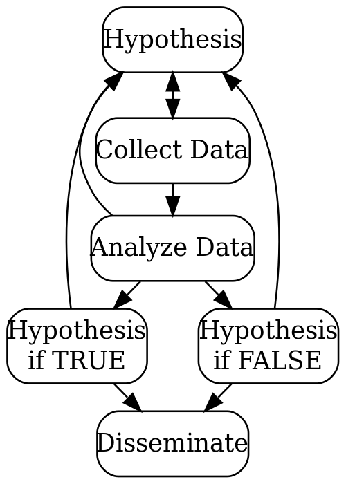

## Lesson preamble:

> ### Lesson objectives:
> 
> - Learn about the scientific method and applying it
> - Learn basics of group dynamics in a team setting
> - Get into your groups, start your projects
>       - Identify which dataset to use
>       - Brainstorm possible research questions
>
> ### Lesson outline:
>
> - What is the scientific method (20 min)
> - Team dynamics and assigning roles and tasks (15-20 min)
> - Getting into groups (10 min)
>     - Exercise (25-30 min)
> - Start project work (20-25 min)
> - Datasets available for use (10-20 min)

-----

```{r message=FALSE, warning=FALSE, include=FALSE, eval=FALSE}
# Run these locally if making changes.
library(dplyr)
DiagrammeR::grViz('
digraph rmarkdown {
    graph [layout = neato, overlap = false, splines = true]
    node [shape = box, style = rounded]

    Hypothesis [pos = "0.75,3.85!"]
    CollectData [label = "Collect Data", pos = "0.75,3!"]
    AnalyzeData [label = "Analyze Data", pos = "0.75,2.25!"]
    HypothesisTrue [label = "Hypothesis\nif TRUE", pos = "0,1.5!"]
    HypothesisFalse [label = "Hypothesis\nif FALSE", pos = "1.5,1.5!"]
    Report [label = "Disseminate", pos = "0.75,0.75!"]

    Hypothesis -> CollectData -> AnalyzeData -> HypothesisTrue -> Report
    AnalyzeData -> HypothesisFalse -> Report
    {HypothesisTrue HypothesisFalse AnalyzeData CollectData} -> Hypothesis
}') %>% 
        DiagrammeRsvg::export_svg() %>%
        charToRaw() %>%
        rsvg::rsvg_png(file = "image/fig_scientific_method.png", 
                       width = 500, height = 700)
```

## Scientific method

<!-- What is the scientific method? -->

### Simplified diagram of the scientific method



### Steps in the scientific process[^sci_method]

1. Identify research question(s).
2. Look into what the previous literature shows.
3. Create one or more hypotheses or objectives.
4. Write up an outline or expected approach to answering those
questions/objectives (analysis and presentation plan):
    - How will the data be obtained and what is the data (i.e. the source)?
    - What statistical/mathematical techniques have previous researchers used?
    Will you use them? Are they appropriate (optional, may need expert)?
    - How will the results/data be presented or visualized (possible
    tables/figures)?
5. Run the planned analyses (or additional ones that come may up).
6. Visualize or present all results from the analyses.
7. Interpret the results and how they fit with the previous literature.
8. Draw conclusions based on the hypotheses/objectives.
9. Disseminate your results (in blogs, pre-print archives, journals, conferences)

[^sci_method]: See [Khan Academy on Scientific Method](https://www.khanacademy.org/science/biology/intro-to-biology/science-of-biology/a/the-science-of-biology) for a brief overview and explanation on the scientific process.

## Team dynamics

### Basics of succeeding as a team

Final assignment is in a group and to succeed, you need to understand team dynamics:

- Communication is **vital** to work together and to achieve the goal
- Teams go through various stages
- Need consensus for group norms, goals, duties/responsibilities, and conduct/behaviour
    - Important that everyone has a stake in the project
- Rotate roles (specifically for the leader/facilitator)

### Stages of group formation

- "Forming-Storming-Norming-Performing-Adjourning Model"[^group_forming]
- Essentially, groups go through stages (not always all and not always in order):
    1. Getting to know one other
    2. Feeling comfortable and safer, testing boundaries
    3. Opening up, voicing opinions, potential for conflict (which can be good!)
    4. Stronger bonds form, cooperative
    5. Greater focus and energy on completion of project
    6. Team ends after project is successfully completed
- These stages can be fast-tracked by discussing norms, duties, and conduct early on

[^group_forming]: See [Principles of Group Dynamics](https://open.lib.umn.edu/principlesmanagement/chapter/13-3-group-dynamics/) 

### Roles and responsibilities

- Leader/Facilitator's duty:
    - Goal is to keep things running smoothly, focused on the task, and on track for time
    - Keep everyone on topic and on task; stay aware of the time
    - (Try to) mediate or resolve any conflicts (there will *always* be some type of conflict; how it's dealt with is what matters)
    - (Try to) encourage everyone to participate and allow everyone a chance at talking
- Recorder's duty:
    - Goal is to write/type down main or important points raised or discussed when team is meeting
    - Keep notes and files organized and orderly
- Organizer's duty:
    - Arrange for next meeting time and location
    - Send reminders to members a day or two before meeting
    - Make and email a simple agenda of tasks to do or to discuss

### Code of conduct

- Vital to establishing boundaries and expectations of being a team member
    - How do you want each member to treat each other?
    - How do you deal with conflict?
    - What is acceptable and unacceptable behaviour?
- These are outlined in the code of conduct
- Mostly its common sense (be kind and respectful)
    - But its important that you as a team write out what everyone wants and agrees to

#### Example Code of Conduct:
- [Contributor Covenant](https://www.contributor-covenant.org/version/1/4/code-of-conduct)
- [UofT Coders Code of Conduct](https://github.com/UofTCoders/studyGroup/blob/gh-pages/codeOfConduct.md)

## Exercise

### As a group, complete these tasks

<!-- show assigned groups -->

- Get into your groups
- Introduce each other:
    - Find out everyone's name and year of study
    - Find out other things about each other (e.g. any plans for next year, etc)
- Create a one or two word "team name". We'll use this to create a shared folder for everyone to use.
- Assign roles to each person (these roles will be rotated in every group setting):
    - You need: facilitator, recorder, organizer
    - Discuss how and when roles will be rotated *(record it)*
- Discuss and brainstorm some codes of conduct you want your team to follow *(record it)*
- Take a few minutes, think about your own skills and what you feel are most competent in
    - Then, share the top one or two of those skills *(record those skills)*
- Discuss how responsibilities of each member will be decided on *(record it)*

## Starting the projects

### Datasets available for use

- [Continuous Plankton Recorder Dataset](https://www.gbif.org/dataset/67c54f85-7910-4cbf-8de4-6f0b136a0e34)

    Data on northern hemisphere plankton species, latitude, longitude, date.
    Going back to 1946. 935 Mb size, almost 2.75 million rows of data.

- [Insecta of Costa Rica](https://www.gbif.org/dataset/3e9817c1-8302-4955-87e3-a408db0ea379)

    Data on insects species in Costa Rica, latitude, longitude, elevation, date.
    1.4 Gb size, almost 3.25 million rows of data.

- [Marine predator and prey body sizes](http://www.esapubs.org/archive/ecol/E089/051/default.htm#data)

    Data from 27 different global locations on species, body measurements,
    latitude, longitude, date. 21 Mb, almost 35,000 rows of data (in long
    format).

- [Mammalian life history](http://www.esapubs.org/archive/ecol/E084/093/default.htm)

    Data about general mammalian life history with species, body size, lifespan,
    litter size, and other reproductive variables. 150 Kb size, 1440 rows of
    data.

- [North American Bird Breeding Survey](https://www.pwrc.usgs.gov/BBS/?CFID=36951359&CFTOKEN=5135bf261f2f1478-471B9FA3-C648-BE26-7C2176ADADE30428)

    Data about number of birds at multiple stops in North America. Many datasets
    of varying rows that need to be linked together. ~`r (50*114)/1000` Gb size
    (can be shortened) across >50 files.
    
- [National Ecological Observatory Network](http://data.neonscience.org/static/browse.html)

    A repository of many large scale ecological datasets from a variety of systems collected over           multiple years at at approximately 50 sites in the USA. Feel free to browse the datasets for ones of     interest to you, but I have highlighted a few below. 
    
    + [Ground beetles in pitfall traps](http://data.neonscience.org/data-product-view?dpCode=DP1.10022.001): ~26 Mb .csv file with ID of ground beetle species from 40 traps arrayed in each of ~50 NEON sites since 2013. 
    + [Macroinvertebrate collection](http://data.neonscience.org/data-product-view?dpCode=DP1.20120.001): ~9 Mb .csv file with ID's of benthid macroinvertebrates from lakes, non-wadeable streams, and wadeable streams from sites across the NEON network dating back to 2014. 
    + [Plant presence/absence and percent cover](http://data.neonscience.org/data-product-view?dpCode=DP1.10058.001): Presence/absence and percent cover of species in 10m^2^, 100m^2^, and 400m^2^ quadrats from multiple plots in each of 50 NEON sites dating back to 2013. This is the dataset we worked with in lecture 9. 
    
- [US EPA National Aquatic Resource Surveys](https://www.epa.gov/national-aquatic-resource-surveys/data-national-aquatic-resource-surveys)

    Numerous datasets from annual surveys of aquatic habitats conducted by the US Environmental             Protection Agency. Includes data relating to the physical environments (e.g. water quality, chemical     properties, landscape variables, etc.) to the biotic environment (e.g. phytoplankton concentrations,     benthic macroinvertebrates, etc.). Be sure to download the metadata as well, which is on the same       page linked above. 
    
- [International Council for the Exploration of the Sea](http://www.ices.dk/marine-data/data-portals/Pages/default.aspx)

    Many large datasets from fish oceanic fish surveys. Includes oceanographic data in addition to          biodiversity datasets, fish stomach content data, physical environmental condition and contaminants,     predation, etc.

- [Alberta Ecological Information System](https://open.alberta.ca/opendata/ecological-information-systems-data)

    Data on vegetation and soil plots in Alberta. Over 26 000 sites are available.
    
- [Beaver abundance and distribution](https://open.canada.ca/data/en/dataset/b9f21e91-d34d-4730-8195-edf051121e9d)

    Aerial and ground surveys of beaver abundance, feeding, and lodge distribution in Elk Island National Park           starting in 1959.
    
- Benthic invertebrate abundance in [Ivvavik](https://open.canada.ca/data/en/dataset/3bad5ce0-0b16-43ee-be32-78cc2f64843f), [Tuktut](https://open.canada.ca/data/en/dataset/9046af59-81c4-4759-8979-f6185af8387d), and [Aulavik](https://open.canada.ca/data/en/dataset/2770949b-043c-4073-bc6c-b38b03a5f528)

    Counts of benthic invertebrate taxa from 3 river corridors from 2009 to 2015. Recommended to use all     3 datasets. 
    
- [Red-backed salamander abundance](https://open.canada.ca/data/en/dataset/3571474b-8d75-491d-816e-f84677b81a7c)

    Abundance of red-backed salamanders from 4 sites in the Bruce Peninsula from 2004 to 2017. 

In addition to the datasets shown above, we encourage students to bring their own datasets for use in their group projects.

### Example hypotheses with figures

> Simple hypothesis: Bigger predators eat bigger prey. 

Easy to identify independent and dependent variables and visualize with plots
and test with linear regression.

> Advanced hypothesis: Which characteristics determine prey size among marine
predators?

Lots of possible groupings available. Start with visualizing some good
candidate variables such as predator weight and length. Realize that the
relationship is more complex than this and start dividing the data set
according to species, water temperature, weather, etc. Use a combination of
visualization and regression analyses. Fit models to the data to determine
which types of regressions are appropriate.

```{r, message=FALSE}
library(tidyverse)
```

```{r, eval=FALSE}
# Read data online and fix colnames
pred_prey <- read_tsv('http://www.esapubs.org/archive/ecol/E089/051/Predator_and_prey_body_sizes_in_marine_food_webs_vsn4.txt')
```

```{r, echo=FALSE}
# download.file(
#     'http://www.esapubs.org/archive/ecol/E089/051/Predator_and_prey_body_sizes_in_marine_food_webs_vsn4.txt',
#     "data/predator_prey_body_size.txt"
#     )
# pred_prey <- read_tsv("data/predator_prey_body_size.txt")
# pred_prey <- sample_n(pred_prey, 1000)
# write_tsv(pred_prey, "data/predator_prey_body_size.txt")
pred_prey <- read_tsv("data/predator_prey_body_size.txt")
```

```{r}
colnames(pred_prey) <- tolower(gsub(' ', '_', colnames(pred_prey)))

# Only adults and some columns of interest
adult_pred_food <- pred_prey %>% 
    mutate(predator_lifestage = tolower(predator_lifestage)) %>% # Mix of upper and lower case...
    filter(predator_lifestage == 'adult') %>% 
    select(predator_common_name, predator_length, prey_mass, predator_mass)

# Summarize data to plot
plot_data <- adult_pred_food %>% 
    group_by(predator_common_name) %>% 
    summarize(
        mean_pred_mass = mean(predator_mass),
        mean_prey_mass = mean(prey_mass),
        mean_pred_length = mean(predator_length)) %>% 
    filter(mean_pred_mass < 8000) # "outliers"

# Plot pred weight vs prey weight
ggplot(plot_data, aes(x = mean_pred_mass, y = mean_prey_mass)) +
    geom_point() +
    geom_smooth()

# Plot pred length vs prey weight
ggplot(plot_data, aes(x = mean_pred_length, y = mean_prey_mass)) +
    geom_point() +
    geom_smooth()
```


### As a group, complete these tasks

In your group, rotate roles (need a facilitator and recorder at minimum). Before
the end of class, finish these:

- Choose two possible datasets (or more) your team would like to work from (can also be
datasets not presented in class) *(record them)*
- Look into the data documentation, see what type of variables there are, what
published articles are available.
- Then, brainstorm as many research questions as possible for those two datasets
*(record them)*
    - Goal is to write down as many ideas as possible
    - No question is off limits and no question is too simple or too complex! 
    - (You might combine or split questions later, just get whatever down!)
    - Just write what ever comes to mind, whether it is an idea or not. Just start writing!

Make sure to *record* everything down! Many of these tasks will also be part of
your mid-project update!

### Set up GitHub account

Before we finish the class, we need to prepare a bit for next class. We need to
create a [GitHub](https://github.com) account!
