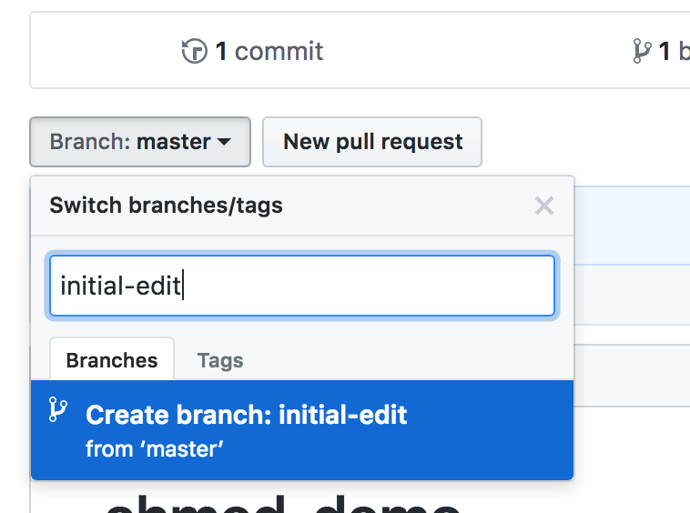
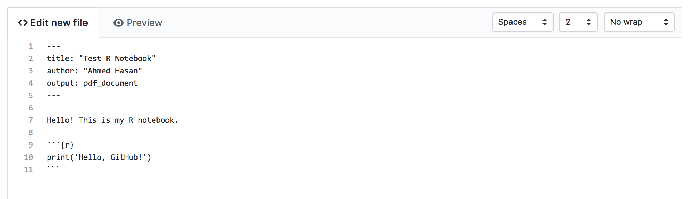
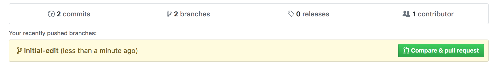
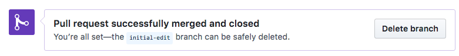

## Lesson preamble

> ### Lesson objectives:
>
> - Understand basic bash commands
> - Understand the logic of version control 
> - Practice using Git commands at the command line
> - Learn how and when to use branches
> - Learn how to effectively use Pull Requests
> - Learn how to work with forks
>
> ### Lesson outline:
>
> - Intro to Git (50 min)
>       - Bash Primer (15 min)
>       - Getting started with Git (5 min)
>       - Version control with Git (30 min)
> - Collaborating with GitHub (50 min)
>       - Creating a fork + GitHub setup (5 min)
>       - Branches and pull requests (40 min)
>       - Issues (5 min)
> - Appendix: Collaborating with GitHub without the command line (50 min)
>
-----

## Intro to Git

Git is a version control system that tracks changes in files. Although it is
primarily used for software development, Git can be used to track changes in
any files, and is an indispensable tool for collaborative projects. Using Git,
we effectively create different versions of our files and track who has made
what changes. The complete history of the changes for a particular project and
their metadata make up a repository. 

To sync the repository across different computers and to collaborate with
others, Git is often used via [GitHub](http://www.github.com), a web-based
service that hosts Git repositories. In the spirit of 'working open' and
ensuring scientific reproducibility, it has also become increasingly common for
scientists to upload scripts and related files to GitHub for others to use.

In this lesson, we'll be covering some basic Git commands, before moving on to
using GitHub for the upcoming group projects.  All members of the group will be
given admin access to a pre-made repository. 

### Command line Git

#### Setup and Installation

Git is primarily used on the command line. The implementation of the command
line that we'll be using is known as a 'bash interpreter', or 'shell'. While
bash interpreters are natively available on Mac and Linux operating systems,
Windows users may have to externally install a bash shell.

To install Git on a **Mac**, you will have to install
[Xcode](https://itunes.apple.com/ca/app/xcode/id497799835?mt=12), which can be
downloaded from the Mac App Store. Be warned: Xcode is a very large download
(approximately 6 GB)! Install Xcode and Git should be ready for use. (_Note:
most students will have already installed Xcode already for some R packages we
used earlier in the course. If you're not sure whether this is the case, run
the `git --version` command described below_)

To install Git (and Bash) on **Windows**, download [Git for
Windows](https://gitforwindows.org/) from its
[website](https://github.com/git-for-windows/git/releases/tag/v2.19.1.windows.1).
At the time of writing, 2.19.1 is the most recent version. Download the `exe`
file to get started. Git for Windows provides a program called Git Bash, which
provides a bash interpreter that can also run Git commands. 

To install Git for **Linux**, use the preferred package manager for your
distribution and follow the instructions [listed
here](https://git-scm.com/download/linux). 

To test whether Git has successfully been installed, open a bash interpreter,
type:

```
git --version
```

and hit Enter. If the interpreter returns a version number, Git has been
installed.

#### Bash Primer

Before we can use Git in the bash interpreter, it's worth learning a few basic
bash commands. All bash commands are run simply by typing them into the
interpreter and pressing Enter. All instances of `foldername` and `filename`
should be replaced with the name of whichever file/folder you would like to
provide as input to the operation.

```
pwd
```

`pwd`, or 'print working directory', will return the folder bash is currently
in. This is similar to the concept of the working directory in R that we
discussed earlier in the course.

```
cd foldername
```

`cd` changes the current working directory to an input folder (in place of
`foldername`). This is useful in tandem with `~`, which is shorthand for 'home
directory' in bash (usually `/Users/[yourname]`).  To navigate to your Desktop,
the command would be `cd ~/Desktop`. 

`cd ..` will let you move back up one folder. If your current working directory
is `/Users/[yourname]/Desktop`, for instance, `cd ..` will change it to
`/Users/[yourname]`. 

```
ls
```

`ls` will return what files/folders are within the current working directory.
This is useful when you have just used `cd` to change your current directory
and need a quick reminder of what's in said directory. 

```
mkdir foldername
```

`mkdir`, or 'make directory', will create a new directory with
the specified name. For instance, `mkdir thesis` will create a folder
called `thesis`, which can then be entered with `cd thesis`.

```
nano filename
```

`nano` is a text editor for Unix-like systems that opens right within the bash
window. If the filename provided doesn't refer to an existing file, `nano` will
create a new file with that name. Once you're done with `nano`, press Control
+ X to exit - `nano` will ask whether you want to save your work, which can be
answered by pressing either `y` or `n`. Alternatively, Control + O followed
by Enter will save your current work, after which Control + X will exit without
prompting.

You can use any other text editor based on your system, such as Notepad on
Windows. 

#### Getting started with Git

First, we have to tell Git who we are. This is especially important
when collaborating with Git and keeping track of who did what!
Keep in mind that this only has to be done the first time we're using Git.

This is done with the `git config` command. When using Git, _all_ commands
begin with `git`, followed by more specific subcommands. 

```
git config --global user.name "My Name"
git config --global user.email "myemail@example.com"
```

Next, we have to set a default text editor for Git. 
Here, we'll use `nano`, as mentioned above:

```
git config --global core.editor "nano"
```

If you would like to set up a different text editor as your default, see
[here](https://swcarpentry.github.io/git-novice/02-setup/index.html).

Finally, the following command can be used to review Git configurations:

```
git config --list
```

#### Version control with Git

Note: *Material for the following section of the class was taught from
[Software Carpentry](www.software-carpentry.org)'s openly available Intro to
Git lesson, which is available in its entirety
[here](http://swcarpentry.github.io/git-novice/).* 

Material covered in class, in order:

- [Creating a repository](https://swcarpentry.github.io/git-novice/03-create/index.html)
- [Tracking changes](https://swcarpentry.github.io/git-novice/04-changes/index.html)
- [Exploring history](https://swcarpentry.github.io/git-novice/05-history/index.html)

##### Summary: Basic Git commands

- `git init` (or `git clone`)
- `git status`
- `git log`
- `git add`
- `git commit`
- `git checkout`

#### Branching

Git commit history is a [directed acyclic
graph](https://en.wikipedia.org/wiki/Directed_acyclic_graph) (or DAG), which
means that every single commit always has at least one 'parent' commit (the
previous commit(s) in the history), and any individual commit can have multiple
'children'. This history can be traced back through the 'lineage' or
'ancestry'.

##### What are branches?

Branches are simply a *named pointer* to a commit in the DAG, which
automatically *move forward* as commits are made. Divergent commits (two
commits with the same parent) could be considered "virtual" branches. Since
they are simply pointers, branches in Git are very lightweight.


##### Why use them?

- To keep experimental work separate
- To separate trials
- To ease collaboration
- To separate bug fixes from development

We will focus more on branches in the second section of the lesson when we
learn about GitHub.


## Collaborating with GitHub

Although command line Git is very useful, GitHub allows for easy use of Git for
collaborative purposes using a primarily point-and-click interface, in addition
to providing a web-based hosting service for Git repositories (or 'repos').  If
you have not already made a GitHub account, do so now [here](www.github.com).

All groups have been provided with existing repositories, but a new repository
can be made by clicking on the `+` in the top right of the page and selecting
'New repository'. For now, however, navigate to your provided group repo.

### Creating a fork

The repos that have already been created can be thought of as 'main repos',
which will contain the 'primary' version of the repo at any given point in
time. However, instead of directly uploading and editing files right within
this main repo itself, we will begin by _forking_ the repo. When a given user
forks a repo, GitHub creates a user-specific copy of the repo and all its
files.

To fork your group's repo, navigate to the repo's page and click on the 'Fork'
button at the top right of the page. Following a brief load screen, GitHub will
redirect you to your new, forked repo.

You'll notice that on the top left of this repo page, the repo's name will be
'[your username] / [repo name]', as opposed to 'EEB313 / [repo name]'.
Furthermore, GitHub will indicate that this is a fork right underneath said
repo name ('forked from eeb313-[year]/ [repo name]'). 

### Branches and Pull Requests

Currently, your fork is identical to what the original repo looked like at the
moment of forking, and so GitHub will indicate that the fork is currently
'even' with its original. Any edits that are made in the fork will be unique to
the fork, leaving the original unchanged.

But how do you add these changes to the main repo? Doing so is a two step
process:

1. First, create a _branch_ on your _fork_ (not the main repo). This is yet 
another copy of the fork (a copy of a copy!) that will store changes separately 
from 'master', which is the default branch. 

2. Once you have made our changes in this branch, submit what's
known as a _pull request_ from this edited branch to the main repo. This 
allows your changes to be reviewed by the other members of your group before 
they are merged into the main repo.

Although this process may seem a bit laborious, using this method (also known
as the 'GitHub flow') minimizes chances of error and ensures that all code is
reviewed by at least one other person. Understanding how and why this process
works is key to collaborative work in software development and the like, and is
used by all sorts of open source projects on GitHub ([including `dplyr`
itself](https://github.com/tidyverse/dplyr)!)

#### Creating a new branch

In a given repo, there is a 'Branch: master' button just above the list of
files. Clicking on this will bring up a dropdown menu containing a list of
branches (which currently just contains `master`) and a text field.  A new
branch can be created by typing in the text field. Start by making a new branch
called `initial-edit` using said text field. GitHub will then refresh, and the
button will now say 'Branch: initial-edit' instead.



The dropdown can now be used to switch back to `master`, but let's stay in
`initial-edit` for now. This is the place to make new changes -- either by
editing existing files or creating new ones. Let's create a simple Rmd file
with the 'Create new file' button on the right side of the repo page.

````
---
title: "Test R Notebook"
author: "Your Name"
output: pdf_document
---

Hello! This is my R notebook.

```{r}`r ''`
print('Hello, GitHub!')
```

````



Once done, scroll to the bottom of the page and add a commit message 
using the text file -- something like 'initial Rmd file creation' --
and then click on 'Commit new file'. 

#### Pull requests

After a commit has been made, GitHub takes you back to the main repo
page, but now with an attention-grabbing yellow prompt about these
new edits. GitHub has noticed that your fork has a new branch with
edits, and over on the right side of the prompt, GitHub presents the
option of creating a pull request.



If you don't see the yellow prompt, head to your fork and switch to the
branch containing your edits. Underneath the green 'Clone or download' 
button, there is a 'Pull request' option -- this can be used to open
a pull request instead. You'll also notice that the left side of this
bar lists how many commits ahead of `master` your branch currently is.

Following either method of opening a pull request, GitHub takes you to
the 'Pull requests' tab of the _main repo_ and prompts you to write about
your pull request. Here, you can (and should) explain the changes you've
made for your group members, so that they know what to look for and review.
Be specific and detailed to save your group members' time -- it's a good
idea to start off your pull request message with an overall summary 
('adding `dplyr` code to clean dataset') followed by a point-form list of
what changes have been made, if necessary. 

Once the pull request has been made, GitHub will list both your message
and your commit messages below. You also have the option of merging the
pull request yourself -- but _don't do this_! When collaborating, always
have someone else review and merge your pull request. 

If all does _not_ look good, your team members can add messages below, and
tag others using the @ symbol, similarly to most social networks. If
more changes are needed before the pull request is ready to merge, 
any new commits you make to the branch on your fork (`initial-edit` in
our case here) will automatically be added on to the pull request.
This way, you can incorporate any changes or fixes suggested by your
team members simply by continuing to work in your fork's new branch
until your changes are ready to merge.

Once a pull request has been merged into the main repo, the branch on your fork 
isn't needed anymore. Because of this, GitHub will immediately prompt you to delete
the `initial-edit` branch as soon as the merge has been completed. 


Great work -- your edits are now on the main repo!

#### Syncing your fork

There's one issue with the above, though -- now, the `master` branch
on your fork is out of date with the current state of the main repo.
The fork has to be synced to remedy this issue. 

First, head to your fork on GitHub, and click on the green 'Clone or 
download' button on the right side of the page. This yields a link 
to your fork. Copy this link to your clipboard.

Next, open a bash shell, and navigate over to whichever folder you would
like a copy of your repo to be saved in. Then, run:

```
git clone [repo link]
```

With the link in place of `[repo link]`. This process, known as _cloning_, will
create a new folder in your current working directory that contains the
contents of your fork. Enter this new folder with `cd` and type `git status` to
make sure the repo has been cloned properly. `git status` should output that
the branch is even with `origin/master`, indicating that it is currently the
same as the current state of your fork. 

To get your fork up to date with the main repo, you next have to add a _remote_ 
linking to the main repo. Head to your group's repo and once again click
on 'Clone or download' to grab its link. Then, using the main repo link, run:

```
git remote add upstream [repo link]
```

Once this is done, run:

```
git remote -v
```

to get a list of existing remotes. This should return four links, two of which
are labelled `origin` and two of which are labelled `upstream`.

Next, you have to _fetch_ the new changes that are in the main repo. 

```
git fetch upstream
```

Once the edits have been downloaded, merge them into your local repo:

```
git merge upstream/master
```

Your local copy is now even with the main repo! Finally,
push these changes to the GitHub version of your fork:

```
git push origin master
```

and now the GitHub version of the fork is all synced up, ready for
your next batch of edits, and eventually another pull request!

#### Keeping your fork up to date

When other group members add to the main repo through their own
pull requests, you have to make sure those edits have been incorporated
into your repo before making new changes of your own. This ensures
that there aren't any conflicts within files, wherein your edits
clash with someone else's if one of you is working with an earlier 
version of the file.

To remain up to date, navigate to the local copy of your repo using
bash, and once again repeat the above steps:

```
git fetch upstream
git merge upstream/master
git push origin master
```
Note: 
The `git pull` command combines two other commands, `git fetch` and `git merge`.

This will download any changes your group members may have made
and update both the local and GitHub versions of your fork accordingly.
Before starting any edits of your own, it's usually a good idea to start off
by checking to see whether anything's been added to the main repo and, if needed,
then syncing your fork to account for that. 

#### Issues

Finally, each repo on GitHub also has an Issues tab at the top of the page.
Here, you and your group can create posts regarding the content of the
repo that highlight issues with code or serve as to-do lists to 
manage outstanding tasks with.

Although issues aren't needed for any of the steps we discussed above,
it can be useful to create a roadmap of your project with them and  
assign group members to specific tasks if need be. 

### To sum up

The 'GitHub flow':

1. Make sure your fork is up to date
2. Create a new branch on your fork
3. Make your edits (with informative commit messages along the way)
4. Submit a pull request
5. Have your group members review your pull request
6. If your group requests further edits prior to merging, make more commits in the new branch
7. Once your edits have been merged, delete your new edits-containing branch
8. Sync your fork to be up to date with the new changes

## Collaborating with GitHub without the command line

The following section is a modified version of the above section that covers
collaboration with GitHub **without** the use of the command line.

All groups have been provided with existing repositories, but a new repository
can be made by clicking on the `+` in the top right of the page and selecting
'New repository'. For now, however, navigate to your provided group repo.

### Creating a fork

The repos that have already been created can be thought of as 'main repos',
which will contain the 'primary' version of the repo at any given point in
time. Although we *will* in fact work within this 'main repo' in this version
of the lesson, we will still begin by _forking_ the repo. When a given user
forks a repo, GitHub creates a user-specific copy of the repo and all its
files.

To fork your group's repo, navigate to the repo's page and click on the 'Fork'
button at the top right of the page. Following a brief load screen, GitHub will
redirect you to your new, forked repo.

You'll notice that on the top left of this repo page, the repo's name will be
'[your username] / [repo name]', as opposed to 'EEB313 / [repo name]'.
Furthermore, GitHub will indicate that this is a fork right underneath said
repo name ('forked from eeb313-[year]/ [repo name]'). 

For the duration of this lesson, we will stick to the `eeb313` version of your
group's repo. Although the fork-based workflow (see above) is much more common
in practice (especially since it works when collaborating on repos that one
*doesn't* have admin access to) it is a bit more advanced and not particularly
needed for these projects. You are of course welcome to incorporate a
fork-based workflow on your own time -- but for the purposes of this class,
your forks can just be used as sandboxes for you to test out things if you'd
like. 

### Branches and Pull Requests

How does one collaboratively work on a single repo? The trick to that involves
**branches**. A **branch** is a copy of the repo that will store changes
separately from `master`, which is the default branch. The `master` branch
should be thought of as the actual current state of your project -- branches
are meant, by design, to be temporary, and exist only to facilitate edits and
experimental work while avoiding any risk of breaking the original codebase. 

The general collaborative workflow is as follows:

1. First, create a _branch_ on the main repo. 

2. Make edits in the branch. These could involve adding/deleting lines of code
   or even adding/removing entire files. Keep in mind that the branch is
separate from the main codebase, so don't worry too much about deleting things
or making large changes.

3. Once you have made your changes in this branch, submit what's known as a
   _pull request_ (PR) from this edited branch to `master`. A PR neatly
packages all the edits that have been made in your branch for review by other
members of your group.

4. Once your changes have been approved, merge the PR. It's good practice to
   have group members merge your PRs instead of doing it yourself. 

Although this process may seem a bit laborious, using this method (also known
as the 'GitHub flow') minimizes chances of error and ensures that all code is
reviewed by at least one other person. Understanding how and why this process
works is key to collaborative work in software development and the like, and is
used by all sorts of open source projects on GitHub ([including `dplyr`
itself](https://github.com/tidyverse/dplyr)!)

#### Creating a new branch

In a given repo, there is a 'Branch: master' button just above the list of
files. Clicking on this will bring up a dropdown menu containing a list of
branches (which currently just contains `master`) and a text field.  A new
branch can be created by typing in the text field. Start by making a new branch
called `initial-edit` using said text field. GitHub will then refresh, and the
button will now say 'Branch: initial-edit' instead.


The dropdown can now be used to switch back to `master`, but let's stay in
`initial-edit` for now. This is the place to make new changes -- either by
editing existing files or creating new ones. Let's create a simple Rmd file
with the 'Create new file' button on the right side of the repo page.

````
---
title: "Test R Notebook"
author: "Your Name"
output: pdf_document
---

Hello! This is my R notebook.

```{r}`r ''`
print('Hello, GitHub!')
```

````


Once done, scroll to the bottom of the page to save your changes. In GitHub
lingo, a saved change is called a **commit** -- this can be thought of more as
a 'checkpoint'.  GitHub _requires_ that all commits have an associated commit
message describing the change. This may seem a bit draconian, but it ensures
that all changes have been documented, which is something that may save you and
your group members a lot of trouble down the line! 

While there is a default commit message GitHub will fill in, it's best to add a
custom one. It's good practice to leave detailed commit messages as much as
possible, so that both your collaborators as well as future you can understand
what each commit did in case something goes wrong down the line. In this case,
however, something like 'initial Rmd file creation' will do.  Click on 'Commit
new file' to complete the process. Note that the radio button underneath
specifically says 'Commit directly to the `initial-edit` branch'.  This means
that your edit will only exist in `initial-edit` for now -- `master` remains
unchanged. 

#### Pull requests

After a commit has been made, GitHub takes you back to the main repo page, but
now with an attention-grabbing yellow prompt about these new edits. GitHub has
noticed that there exists a new branch with edits and that these edits differ
from what's in `master`. Over on the right side of the prompt, GitHub presents
the option of creating a _pull request_ (PR). A PR is GitHub's way of neatly
packaging one or more commits that have been made in a branch into a single
request to merge said commits into `master`. In our case, a PR is essentially
you telling your group members: "Here are all the edits I've made. Have a look,
and add them to `master` if you think they're ready to go."


If you don't see the yellow prompt, switch to the branch containing your edits.
Notice the 'New pull request' button next to the branch dropdown -- this can be
used to open a pull request instead. You'll also notice that the left side of
this bar lists how many commits ahead of `master` your branch currently is.

Following either method of opening a pull request, GitHub takes you to the
'Pull requests' tab of the repo and prompts you to write about your pull
request (i.e. describe the changes you're attempting to merge). Here, you can
(and should) explain the changes you've made for your group members, so that
they know what to look for and review.  Be specific and detailed to save your
group members' time -- it's a good idea to start off your pull request message
with an overall summary ('adding `dplyr` code to clean dataset') followed by a
point-form list of what changes have been made, if necessary. 

Once the pull request has been made, GitHub will list both your message and
your commit messages below. Clicking on any of these commits opens up a new
page highlighting the changes made in that specific commit. You also have the
option of merging the pull request yourself -- but _don't do this_! When
collaborating, always have someone else review and merge your pull request. 

If all does _not_ look good, your team members can add messages below, and tag
others using the @ symbol, similarly to most social networks. If more changes
are needed before the pull request is ready to merge, any new commits you make
to the branch on your fork (`initial-edit` in our case here) will automatically
be added on to the pull request.  This way, you can incorporate any changes or
fixes suggested by your team members simply by continuing to work in your
fork's new branch until your changes are ready to merge. For line-specific
edits, if a file is opened up (i.e. by clicking on one of the commits),
clicking on the `+` button that appears when hovering over a line number will
allow you or a group member to add a comment specifically attached to that
line. This can be useful when pointing out typos, for instance, among other
things. 

Once a pull request has been merged into the main repo, the `initial-edit`
branch (or whatever you have named your branch) isn't needed anymore. Because
of this, GitHub will immediately prompt you to delete the `initial-edit` branch
as soon as the merge has been completed right in the PR. 



Great work -- your edits are now on `master`!

#### Resolving merge conflicts

Unfortunately, things aren't always as smooth as the above process. Often,
there may exist two versions of the same file with divergent edit histories.
Here are a few scenarios where this might happen:

1. You create a branch called `update-plots`. In a file called `plots.Rmd`, you
   add code for a bar plot. However, someone makes the mistake of working
directly in `master`, and writes code for something else in the same file. When
you create your PR from `update-plots`, Git has trouble merging your edits,
since there would exist two separate blocks of code in the same part of the
`master` file if it did. Git is not sure which one should take precedence, and
will not make assumptions. 

2. After explaining to your collaborator that editing in `master` should be
   avoided, you create a branch called `add-models` and do some stats in a file
called `analysis.Rmd`. However, you take the weekend off, and in the interim,
one of your group members creates a separate branch called `do-stats` and edits
the same file. You both start from the same file, but your final files look
different. Both of you submit PRs. The first PR to get merged has no issues,
but the second PR cannot be merged into `master`, because the `master` version
of `analysis.Rmd` has now changed.

To deal with issues like these, GitHub allows for _merge conflict resolution_.
The way resolution works is that a conflicting PR can still be submitted, but
the 'Merge pull request' button will be greyed out. Instead, there will be a
'Resolve conflicts' button, which opens up a text editor in the browser. The
text editor will show the file but contain *both* versions of the conflicting
edits, essentially asking you to delete whichever version of the text you want
removed. The offending lines should look something like this:

```
<<<<<<< test-update
print('Hello')
=======
print('Goodbye')
>>>>>>> master
```

This tells us that `print('Hello')` is what's on this line in this file in the
`test-update` branch, while the `master` branch has `print('Goodbye')` on the
same line. To keep the `test-update` version, all of the text here has to be
deleted except for that line of code, including the separator (`=======`) line
as well as the lines listing the branches. In the end, it should simply look like
this:

```
print('Hello')
```

after which the 'Mark as resolved' button on the top right of the text editor
will be un-greyed. Once that has been clicked, click on the new 'Commit merge'
button to fix the issue, which will redirect back to the PR page. The PR can
now be merged! 

### To sum up

The 'GitHub flow', without the command line:

1. While in `master`, create a new branch
2. Make your edits (with informative commit messages along the way)
3. Submit a pull request
4. Have your group members review your pull request
5. If your group requests further edits prior to merging, make more commits in
   the new branch
6. Once your edits have been merged into `master`, delete your branch


Additional resources:

- [A visual demonstration](https://guides.github.com/introduction/flow/) of the GitHub flow.
- A useful [Git command cheat sheet](https://services.github.com/on-demand/downloads/github-git-cheat-sheet.pdf).
- Guide to a [good Git Workflow](https://www.atlassian.com/git/tutorials/comparing-workflows)


