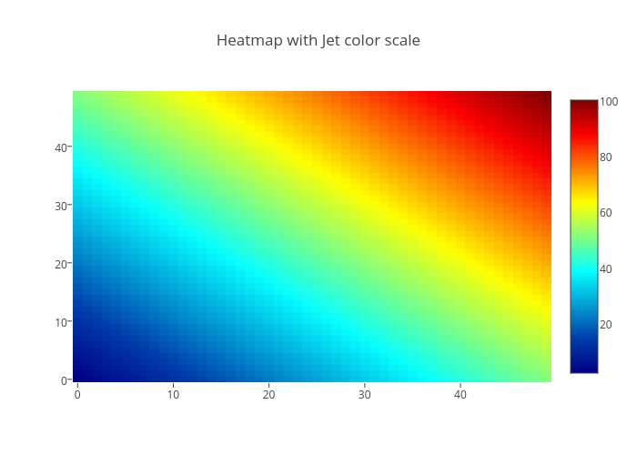
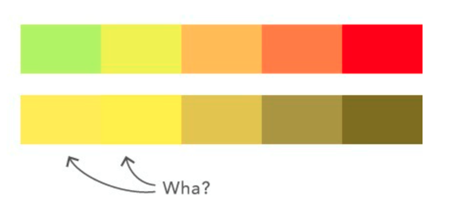

## Lesson preamble

> ### Learning Objectives
>
> - Making better plots for outreach and communication.
> - How to save your plots.
> - How to bin and summarise in 2d using hexagons and squares.
> - How to make your graphs accessible.

> 
> ### Lesson outline
>
> - How to visualize data (review) (5 min)
> - Saving your graphs (5 min)
> - Review of plot choice (5 min)
> - 2D histograms, square and hexagonal bins (10 min)
> - Interactive and quick graphing (10 min)
> - Graphing and accessability (5 min)
>
> ### Setup
>
> - Load `ggplot2` (`library("ggplot2")`).

-----

## Tufte's guidelines

* Reduce non-data ink
* Enhance the data ink

Reduces the proportion of graphic’s ink devoted to the non-redundant display of data-information,

Avoid "chartjunk" - extraneous visual elements that detract from message.

## Colour rules

* Large background colours should be quiet, muted to let brighter colors stand out
* To highlight some element of a figure, using a bright colour can be effective
* However, if brightly colouring this aspect of your figure serves no purpose, leave it greyscale/plain
* Here is a reference sheet with all the [colours and colour names in R](http://www.stat.columbia.edu/~tzheng/files/Rcolor.pdf)

## Summary

* Determine what type of data you have and how your data will be used
* Determine how many variable types are in your data
* Decide on a visual treatment for each of the variables 
* Focus on the data in your visual representation


## Setting up

Load or install the required packages:

```{r}
library(ggplot2)
```


## Let's get started!

## Saving graphs

When using ggsave, R by default saves the last graph you plotted. You can also use the GUI to export and save as an image or PDF.

```{r, eval=FALSE}
ggsave("filename.jpg")
ggsave("filename.jpg", width = 20, height = 20, units = "cm")
```

One quirk about RStudio is that if you don't specify the size of the graph, ggsave will save the graph as the same size as it appears in your plots window. This may or may not be what you want.

Try saving this graph:
```{r}
ggplot(iris, aes(x = Sepal.Width, y = Sepal.Length, color = Species)) + 
    geom_point()
```

## Oversaturated graphs and plot choice

Last week we talked about how summary plots (especially bar plots) can sometimes be misleading, and it is often most appropriate/ideal to show every individual observation with a dot plot or the like, perhaps combined with summary markers where appropriate. But, as we discussed last week, what if you have a gigantic data set with a zillion observations? In large data sets, it is often the case that plotting each individual observation would oversaturate the chart. 

Let's actually take a look at an oversaturated chart using one of the native datasets, `diamonds`:

```{r}
ggplot(diamonds, aes(x = carat, y = price)) + 
  geom_point()
```

Because this is a dataset with 53940 observations and we are plotting it on two dimensions, the resulting graph is incredibly oversaturated. Oversaturated graphs make it *far more* difficult to glean information from the visualization. We're going to get into a few last methods of dealing with this problem.

First, let's try making a 2D hexagonal heatmap (really a fancy histogram) with our huge diamonds dataset. 

(It might seem like we're skipping ahead in terms of graph complexity. To learn how to make a super simple histogram with simple count data, see [here](http://ggplot2.tidyverse.org/reference/geom_histogram.html))

```{r}
g <- ggplot(diamonds, aes(x = carat, y = price))
g + 
  geom_hex()
```

What has this changed? Now we have a handy legend to the right of our graph indicating the density of points across 2D space in our large dataset. We've created our first heat map.

Wikipedia's definition of a heat map:

["A heat map (or heatmap) is a graphical representation of data where the individual values contained in a matrix are represented as colors."](https://en.wikipedia.org/wiki/Heat_map)

We've now added additional information to our graph and solved the saturation problem we encountered in our first graph. If you want to change the bin size (i.e. the size of the hexagons), you can do so as such:

```{r}
g <- ggplot(diamonds, aes(x = carat, y = price))
g + 
  geom_hex(bins = 90)
```

[Here](http://ggplot2.tidyverse.org/reference/geom_hex.html) are more resources on hexagonal 2D heatmaps. 

If we want our heat map to be square, rather than hexagonal, we can use the following geom:

```{r}
g <- ggplot(diamonds, aes(x = carat, y = price))
g + 
  geom_bin2d()
```

[Documentation for square/rectangular heat maps of 2D bin counts](http://ggplot2.tidyverse.org/reference/geom_bin2d.html)

## Making your graphs accessible

Colour blindness is common in the population, and red-green colour blindness in particular affects 8% of men and 0.5% of women. Guidelines for making your visualizations more accessible to people affected by colour blindness, will in many cases also improve the interpretability of your graphs for people who have standard color vision. Here are a couple of examples:

Don't use jet rainbow-coloured heatmaps. Jet colourmaps are often the default heatmap used in many visualization packages (you've probably seen them before). 



Colour blind viewers are going to have a difficult time distinguishing the meaning of this heat map if some of the colours blend together.



The jet colormap should be avoided for other reasons, including that the sharp transitions between colors gives introduces visual threshold levels that do not represent the underlying continuous data, more details about jet can be found in [this blog post](https://jakevdp.github.io/blog/2014/10/16/how-bad-is-your-colormap/) and [this series of posts](https://mycarta.wordpress.com/2012/05/12/the-rainbow-is-dead-long-live-the-rainbow-part-1/). In general, when presenting continuous data, a perceptually uniform colormap is often the most suitable choice. This type of colormap ensures that equal steps in data are perceived as equal steps in color space. The human brain perceives changes in lightness as changes in the data much better than, for example, changes in hue. Therefore, colormaps which have monotonically increasing lightness through the colormap will be better interpreted by the viewer. More details and examples of such colormaps are available in the [matplotlib documentation](http://matplotlib.org/users/colormaps.html), and many of the core design principles are outlined in [this entertaining talk](https://www.youtube.com/watch?v=xAoljeRJ3lU). Most of these colormaps are [available in R](http://r4ds.had.co.nz/graphics-for-communication.html#fig:brewer). 

Another approach is to use both colours and symbols. 

```{r}
ggplot(iris, aes(x = Sepal.Width, y = Sepal.Length, color = Species)) + 
  geom_point(aes(shape = factor(Species)), , size = 3)
```

> #### Challenge
>
> Create any coloured figure you want and go to 
> [this](http://www.color-blindness.com/coblis-color-blindness-simulator/) 
> website to upload it to see how it 
> looks to a colour blind person 


For more resources, [here](http://blog.usabilla.com/how-to-design-for-color-blindness/) is a great usability article for designing for people with colour blindness.

## More resources on ggplot2

* [ggplot2 documentation](http://had.co.nz/ggplot2/)
* [Book by Hadley Wickham](https://www.amazon.com/ggplot2-Elegant-Graphics-Data-Analysis/dp/0387981403)
* [ggplot2 cheat sheet](https://www.rstudio.com/wp-content/uploads/2015/03/ggplot2-cheatsheet.pdf)
* [r graph gallery for inspiration (not just limited to ggplot2 graphs)](https://www.r-graph-gallery.com/all-graphs/)


